# توثيق تصميم قاعدة البيانات لمشروع (AroundU)

يحتوي هذا المستند على التصميم الكامل والجاهز لقاعدة البيانات الخاصة بمشروع التخرج **AroundU**. تم تصميم قاعدة البيانات بالاعتماد على **PostgreSQL** مع الامتداد الجغرافي **PostGIS**، وتضم **32 جدولاً** مقسمة في **8 مجموعات (Clusters)** رئيسية لتنظيم وإدارة الوظائف المختلفة للنظام.

---

## 1. نظرة عامة على التصميم الفني

| المعيار الفني | الوصف والتقنيات المستخدمة |
| :--- | :--- |
| **نظام إدارة قواعد البيانات (DBMS)** | PostgreSQL (نسخة 15+) |
| **الدعم الجغرافي (Geospatial)** | PostGIS — استخدام نوع البيانات الجغرافية `geography(Point, 4326)` |
| **محرك البحث النصي (Full-Text Search)** | استخدام `TSVECTOR` المدمج مع فهارس `GIN` لدعم البحث السريع باللغة العربية والإنجليزية |
| **طبقة ربط البيانات (ORM)** | SQLAlchemy 2.0 (Declarative Mapping) |
| **إدارة الهجرة والترقيات (Migrations)** | Alembic |
| **آلية الحذف المؤقت (Soft Delete)** | مطبق على الجداول الحساسة تاريخياً (`users`, `subcategories`, `items`, `sub_items`) باستخدام الحقلين `is_deleted` و `deleted_at` |
| **نمط لقطة البيانات (Snapshot Pattern)** | مطبق في جداول الطلبات والسلات (`order_items`, `cart_items`) لضمان عدم تأثر السجلات التاريخية للأسعار بتعديلات المنتجات اللاحقة |
| **المعرفات الأساسية (Primary Keys)** | استخدام العداد التلقائي (`SERIAL`) لمعظم الجداول، واستخدام `UUID` للحقول الحساسة الأمنية |

---

## 2. مخطط العلاقات الكامل (ERD) باستخدام Mermaid

يمكنك نسخ كود Mermaid التالي وعرضه في أي محرر يدعم Mermaid (مثل VS Code أو Notion أو mermaid.live):

```mermaid
erDiagram
    %% ====== AUTH CLUSTER ======
    users {
        int id PK
        varchar firebase_uid UK
        varchar provider
        varchar full_name
        varchar email UK
        varchar password_hash
        varchar role
        varchar owner_type
        boolean is_active
        boolean is_verified
        boolean is_deleted
        timestamptz deleted_at
        varchar verification_token
        varchar reset_token
        timestamptz reset_token_expires
        timestamptz created_at
        timestamptz updated_at
    }

    refresh_tokens {
        int id PK
        int user_id FK
        int device_id FK
        varchar token_hash UK
        varchar family_id
        boolean is_revoked
        timestamptz expires_at
        timestamptz created_at
        timestamptz updated_at
    }

    device_tokens {
        int id PK
        int user_id FK
        varchar fcm_token UK
        varchar device_model
        varchar os_version
        varchar ip_address
        boolean is_active
        timestamptz last_active_at
        timestamptz created_at
    }

    password_reset_tokens {
        uuid id PK
        int user_id FK
        varchar token_hash UK
        timestamptz expires_at
        boolean is_used
        timestamptz created_at
    }

    audit_logs {
        int id PK
        int user_id FK
        varchar action
        varchar ip_address
        varchar device_info
        jsonb metadata_info
        timestamptz created_at
    }

    service_api_keys {
        uuid id PK
        varchar service_name
        varchar api_key_hash UK
        jsonb permissions
        jsonb allowed_ips
        boolean is_active
        timestamptz created_at
        timestamptz last_used_at
    }

    %% ====== PLACES & MENU CLUSTER ======
    categories {
        int id PK
        varchar name UK
        varchar icon
        timestamptz created_at
    }

    places {
        int id PK
        varchar name
        text description
        varchar address
        varchar_array phone
        varchar website
        varchar instagram_url
        varchar facebook_url
        varchar whatsapp_number
        varchar tiktok_url
        float rating
        int review_count
        int favorite_count
        tsvector search_vector
        float latitude
        float longitude
        geography location
        int category_id FK
        int owner_id FK
        int parent_id FK
        boolean is_active
        float delivery_price
        boolean is_free_delivery
        jsonb delivery_zones
        boolean is_accepting_orders
        boolean accepts_delivery
        boolean accepts_takeaway
        varchar working_hours
        timestamptz created_at
        timestamptz updated_at
    }

    place_images {
        int id PK
        int place_id FK
        varchar image_url
        varchar image_type
        text caption
        timestamptz created_at
    }

    subcategories {
        int id PK
        varchar name
        int place_id FK
        int owner_id FK
        boolean is_deleted
        timestamptz deleted_at
        timestamptz created_at
        timestamptz updated_at
    }

    items {
        int id PK
        varchar name
        text description
        numeric price
        varchar image_url
        boolean is_available
        int sub_category_id FK
        boolean is_deleted
        timestamptz deleted_at
        timestamptz created_at
        timestamptz updated_at
    }

    sub_items {
        int id PK
        varchar name
        text description
        numeric price
        boolean is_available
        int item_id FK
        boolean is_deleted
        timestamptz deleted_at
        timestamptz created_at
        timestamptz updated_at
    }

    %% ====== SOCIAL CLUSTER ======
    reviews {
        int id PK
        int user_id FK
        int place_id FK
        float rating
        text comment
        varchar sentiment
        timestamptz created_at
        timestamptz updated_at
    }

    favorites {
        int id PK
        int user_id FK
        int place_id FK
        timestamptz created_at
        timestamptz updated_at
    }

    %% ====== REAL ESTATE CLUSTER ======
    properties {
        int id PK
        varchar title
        text description
        float price
        float latitude
        float longitude
        varchar main_image_url
        varchar_array contact_number
        varchar whatsapp_number
        boolean is_available
        varchar owner_name
        int owner_id FK
        timestamptz created_at
        timestamptz updated_at
    }

    property_images {
        int id PK
        int property_id FK
        varchar image_url
        timestamptz created_at
    }

    property_reviews {
        int id PK
        int user_id FK
        int property_id FK
        float rating
        text comment
        timestamptz created_at
        timestamptz updated_at
    }

    property_favorites {
        int id PK
        int user_id FK
        int property_id FK
        timestamptz created_at
        timestamptz updated_at
    }

    %% ====== ANALYTICS & AI CLUSTER ======
    interactions {
        int id PK
        int user_id FK
        int place_id FK
        varchar type
        float user_lat
        float user_lon
        int cluster_id
        timestamptz created_at
    }

    ai_interactions {
        int id PK
        int user_id FK
        varchar session_id
        text message
        varchar message_source
        float user_lat
        float user_lon
        text reply
        varchar intent
        float confidence
        jsonb entities
        jsonb best_place
        int latency_ms
        int is_fallback
        timestamptz created_at
    }

    chat_messages {
        int id PK
        int user_id FK
        text message
        text reply
        timestamptz created_at
    }

    conversations {
        int id PK
        int user_id FK
        timestamptz created_at
    }

    messages {
        int id PK
        int conversation_id FK
        varchar sender
        text content
        timestamptz timestamp
    }

    %% ====== NOTIFICATIONS CLUSTER ======
    notifications {
        int id PK
        int user_id FK
        int request_id FK
        varchar title
        varchar message
        varchar type
        varchar priority
        boolean is_read
        jsonb data
        timestamptz created_at
    }

    notification_requests {
        int id PK
        int sender_id FK
        varchar target_type
        int target_user_id FK
        varchar title
        text message
        jsonb data
        varchar status
        boolean is_archived
        int approved_by FK
        timestamptz approved_at
        timestamptz created_at
    }

    notification_audits {
        int id PK
        int request_id FK
        int admin_id FK
        varchar action
        timestamptz timestamp
    }

    %% ====== E-COMMERCE CLUSTER ======
    orders {
        int id PK
        int user_id
        int place_id FK
        varchar order_type
        varchar status
        varchar full_name
        varchar phone_number
        varchar address
        varchar notes
        float total_price
        timestamptz created_at
    }

    order_items {
        int id PK
        int order_id FK
        int item_id
        int sub_item_id
        varchar item_name
        varchar image_url
        float unit_price
        int quantity
        float total_price
    }

    carts {
        int id PK
        int user_id
        int place_id FK
        float total_price
        timestamptz created_at
    }

    cart_items {
        int id PK
        int cart_id FK
        int item_id
        varchar item_name
        varchar image_url
        int quantity
        float unit_price
    }

    %% ====== SEARCH CLUSTER ======
    search_history {
        int id PK
        int user_id FK
        varchar query
        timestamptz created_at
        timestamptz updated_at
    }

    search_trends {
        varchar query PK
        int count
        timestamptz last_searched_at
    }

    %% ====== RELATIONSHIPS ======
    users ||--o{ refresh_tokens : "has"
    users ||--o{ device_tokens : "has"
    users ||--o{ password_reset_tokens : "has"
    users ||--o{ audit_logs : "logged in"
    users ||--o{ places : "owns"
    users ||--o{ subcategories : "owns"
    users ||--o{ reviews : "writes"
    users ||--o{ favorites : "has"
    users ||--o{ properties : "owns"
    users ||--o{ property_reviews : "writes"
    users ||--o{ property_favorites : "has"
    users ||--o{ interactions : "makes"
    users ||--o{ ai_interactions : "has"
    users ||--o{ chat_messages : "has"
    users ||--o{ conversations : "has"
    users ||--o{ search_history : "has"
    users ||--o{ notifications : "receives"
    users ||--o{ notification_requests : "sends"

    refresh_tokens }o--|| device_tokens : "linked to"

    categories ||--o{ places : "classifies"

    places ||--o{ place_images : "has"
    places ||--o{ subcategories : "has"
    places ||--o{ reviews : "receives"
    places ||--o{ favorites : "in"
    places ||--o{ interactions : "receives"
    places ||--o{ orders : "receives"
    places ||--o{ carts : "has"
    places ||--o{ places : "has branches"

    subcategories ||--o{ items : "contains"
    items ||--o{ sub_items : "has variants"

    properties ||--o{ property_images : "has"
    properties ||--o{ property_reviews : "receives"
    properties ||--o{ property_favorites : "in"

    conversations ||--o{ messages : "contains"

    notification_requests ||--o{ notifications : "generates"
    notification_requests ||--o{ notification_audits : "audited by"

    orders ||--o{ order_items : "contains"
    carts ||--o{ cart_items : "contains"
```



---

## 3. تفاصيل الجداول حسب مجموعات البيانات (Clusters)

### المجموعة الأولى: المصادقة والمستخدمين (Auth Cluster)

تتعامل هذه المجموعة مع تسجيل دخول المستخدمين، إدارة الجلسات، الصلاحيات، وسجلات النشاط والأمان.

#### 1.1 جدول المستخدمين (`users`)
يخزن بيانات الحساب لجميع الفئات (المستخدم العادي، صاحب المكان، والأدمن).
* **اسم الكلاس بالـ ORM:** `User`
* **الحذف المؤقت:** مدعوم (`is_deleted` + `deleted_at`)

| العمود | نوع البيانات في SQL | القابلية للقيمة الفارغة (Nullable) | القيمة الافتراضية | نوع المفتاح | الوصف |
| :--- | :--- | :--- | :--- | :--- | :--- |
| `id` | `SERIAL` (INTEGER) | NOT NULL | العداد التلقائي | **PK** | المعرّف الفريد الأساسي للمستخدم |
| `firebase_uid` | `VARCHAR` | NULL | — | **UNIQUE** | معرّف Firebase للمصادقة عبر جوجل وسوشيال ميديا |
| `provider` | `VARCHAR` | NULL | `'local'` | — | مزوّد الخدمة: `local` للمحلي أو `google` للتوثيق الخارجي |
| `full_name` | `VARCHAR` | NOT NULL | — | — | الاسم الكامل للمستخدم |
| `email` | `VARCHAR` | NULL | — | **UNIQUE** | البريد الإلكتروني (فارغ في حال التوثيق برقم هاتف أو حساب خارجي) |
| `password_hash` | `VARCHAR` | NULL | — | — | كلمة المرور المشفرة (فارغة في حال استخدام جوجل) |
| `role` | `VARCHAR` | NOT NULL | `'USER'` | — | الدور والصلاحية: `USER`, `OWNER`, `ADMIN` |
| `owner_type` | `VARCHAR` | NULL | — | — | نوع المالك إذا كان صاحب منشأة: `COMMERCIAL` أو `RESIDENTIAL` |
| `is_active` | `BOOLEAN` | NOT NULL | `TRUE` | — | حالة تفعيل الحساب |
| `is_verified` | `BOOLEAN` | NOT NULL | `FALSE` | — | هل تم التحقق من البريد الإلكتروني |
| `is_deleted` | `BOOLEAN` | NOT NULL | `FALSE` | — | علم الحذف المؤقت (Soft Delete) |
| `deleted_at` | `TIMESTAMPTZ` | NULL | — | — | توقيت حدوث الحذف المؤقت |
| `verification_token`| `VARCHAR` | NULL | — | — | رمز التحقق المرسل عبر البريد الإلكتروني |
| `reset_token` | `VARCHAR` | NULL | — | — | رمز إعادة تعيين كلمة المرور (للاستخدام السريع) |
| `reset_token_expires`| `TIMESTAMPTZ`| NULL | — | — | تاريخ انتهاء رمز إعادة التعيين |
| `created_at` | `TIMESTAMPTZ` | NOT NULL | `NOW()` | — | وقت وتاريخ إنشاء الحساب |
| `updated_at` | `TIMESTAMPTZ` | NULL | — | — | وقت وتاريخ آخر تحديث للبيانات |

---

#### 1.2 جدول رموز التحديث للتوثيق (`refresh_tokens`)
يستخدم لإصدار الجلسات المستمرة وتطبيق حماية التدوير (Token Rotation).
* **اسم الكلاس بالـ ORM:** `RefreshToken`

| العمود | نوع البيانات في SQL | Nullable | القيمة الافتراضية | نوع المفتاح | الوصف |
| :--- | :--- | :--- | :--- | :--- | :--- |
| `id` | `SERIAL` | NOT NULL | العداد التلقائي | **PK** | معرّف رمز التحديث |
| `user_id` | `INTEGER` | NOT NULL | — | **FK** | يربط بـ `users.id` (يُحذف مع حذف المستخدم CASCADE) |
| `device_id` | `INTEGER` | NULL | — | **FK** | يربط بـ `device_tokens.id` (يتحول لـ NULL عند حذف الجهاز) |
| `token_hash` | `VARCHAR` | NOT NULL | — | **UNIQUE** | هاش SHA-256 لرمز التحديث لضمان الأمان الفائق |
| `family_id` | `VARCHAR` | NOT NULL | — | — | لربط الرموز المتتالية بجلسة واحدة لاكتشاف سرقة الجلسة |
| `is_revoked` | `BOOLEAN` | NOT NULL | `FALSE` | — | هل تم إبطال الرمز (بسبب تسجيل خروج أو شك أمني) |
| `expires_at` | `TIMESTAMPTZ` | NOT NULL | — | — | تاريخ انتهاء الجلسة (30 يوم افتراضياً) |
| `created_at` | `TIMESTAMPTZ` | NOT NULL | `NOW()` | — | تاريخ إنشاء الجلسة |
| `updated_at` | `TIMESTAMPTZ` | NULL | — | — | تاريخ تعديل الجلسة |

---

#### 1.3 جدول رموز الأجهزة الإشعارية (`device_tokens`)
لتخزين رموز Firebase Cloud Messaging (FCM) لكل جهاز لإرسال الإشعارات.
* **اسم الكلاس بالـ ORM:** `DeviceToken`

| العمود | نوع البيانات في SQL | Nullable | القيمة الافتراضية | نوع المفتاح | الوصف |
| :--- | :--- | :--- | :--- | :--- | :--- |
| `id` | `SERIAL` | NOT NULL | العداد التلقائي | **PK** | المعرّف الأساسي للجهاز |
| `user_id` | `INTEGER` | NOT NULL | — | **FK** | يربط بـ `users.id` (CASCADE) |
| `fcm_token` | `VARCHAR` | NOT NULL | — | **UNIQUE** | رمز الدفع الخاص بـ Firebase للجهاز |
| `device_model` | `VARCHAR` | NULL | — | — | موديل الهاتف (مثل iPhone 15 Pro) |
| `os_version` | `VARCHAR` | NULL | — | — | إصدار نظام التشغيل (مثل iOS 17) |
| `ip_address` | `VARCHAR` | NULL | — | — | آخر عنوان IP مسجل للجهاز |
| `is_active` | `BOOLEAN` | NOT NULL | `TRUE` | — | هل الجهاز نشط ومستعد لاستقبال الإشعارات |
| `last_active_at`| `TIMESTAMPTZ` | NOT NULL | `NOW()` | — | تاريخ آخر نشاط مسجل |
| `created_at` | `TIMESTAMPTZ` | NOT NULL | `NOW()` | — | تاريخ ربط الجهاز بالحساب |

---

#### 1.4 جدول رموز إعادة تعيين كلمة المرور الحساسة (`password_reset_tokens`)
* **اسم الكلاس بالـ ORM:** `PasswordResetToken`

| العمود | نوع البيانات في SQL | Nullable | القيمة الافتراضية | نوع المفتاح | الوصف |
| :--- | :--- | :--- | :--- | :--- | :--- |
| `id` | `UUID` | NOT NULL | `gen_random_uuid()`| **PK** | معرّف UUID ليكون غير قابل للتخمين نهائياً |
| `user_id` | `INTEGER` | NOT NULL | — | **FK** | يربط بـ `users.id` (CASCADE) |
| `token_hash` | `VARCHAR` | NOT NULL | — | **UNIQUE** | الهاش للرمز السري المبعوث في البريد الإلكتروني |
| `expires_at` | `TIMESTAMPTZ` | NOT NULL | — | — | تاريخ الصلاحية للرمز (30 دقيقة فقط للأمان) |
| `is_used` | `BOOLEAN` | NOT NULL | `FALSE` | — | يتحول إلى `TRUE` عند استخدام الرمز لمرة واحدة |
| `created_at` | `TIMESTAMPTZ` | NOT NULL | `NOW()` | — | وقت التوليد للرمز |

---

#### 1.5 جدول سجلات تدقيق الأمان والعمليات (`audit_logs`)
لتسجيل نشاطات النظام الحساسة وتتبع الأخطاء الأمنية.
* **اسم الكلاس بالـ ORM:** `AuditLog`

| العمود | نوع البيانات في SQL | Nullable | القيمة الافتراضية | نوع المفتاح | الوصف |
| :--- | :--- | :--- | :--- | :--- | :--- |
| `id` | `SERIAL` | NOT NULL | العداد التلقائي | **PK** | المعرّف للحدث |
| `user_id` | `INTEGER` | NULL | — | **FK** | يربط بـ `users.id` (يتغير لـ SET NULL للحفاظ على السجل عند حذف الحساب) |
| `action` | `VARCHAR` | NOT NULL | — | — | الإجراء المنفذ (مثل `login`, `password_change`, `api_key_created`) |
| `ip_address` | `VARCHAR` | NULL | — | — | عنوان الـ IP الذي نفذ العملية |
| `device_info` | `VARCHAR` | NULL | — | — | بيانات متصفح العميل أو جهازه |
| `metadata_info` | `JSONB` | NULL | — | — | معلومات تفصيلية مرنة عن العملية يتم حفظها كملف جيسون |
| `created_at` | `TIMESTAMPTZ` | NOT NULL | `NOW()` | — | تاريخ تسجيل الحدث |

---

#### 1.6 جدول مفاتيح الـ API للمصادر الخارجية (`service_api_keys`)
مخصص للتوثيق الصديق من الأنظمة والـ Microservices الأخرى (مثل خادم الذكاء الاصطناعي).
* **اسم الكلاس بالـ ORM:** `ServiceAPIKey`

| العمود | نوع البيانات في SQL | Nullable | القيمة الافتراضية | نوع المفتاح | الوصف |
| :--- | :--- | :--- | :--- | :--- | :--- |
| `id` | `UUID` | NOT NULL | `gen_random_uuid()`| **PK** | المعرف الفريد للـ Key |
| `service_name` | `VARCHAR` | NOT NULL | — | — | اسم الخدمة المخولة باستخدام المفتاح |
| `api_key_hash` | `VARCHAR` | NOT NULL | — | **UNIQUE** | الهاش الآمن للـ Key لحمايته من السرقة في قاعدة البيانات |
| `permissions` | `JSONB` | NOT NULL | — | — | قائمة الصلاحيات بصيغة JSON (مثل `["read:places", "write:interactions"]`) |
| `allowed_ips` | `JSONB` | NULL | — | — | قائمة بالـ IPs الحصرية المسموح لها باستخدام هذا المفتاح للشبكة الآمنة |
| `is_active` | `BOOLEAN` | NOT NULL | `TRUE` | — | حالة تفعيل المفتاح |
| `created_at` | `TIMESTAMPTZ` | NOT NULL | `NOW()` | — | تاريخ الإنشاء للمفتاح |
| `last_used_at` | `TIMESTAMPTZ` | NULL | — | — | تاريخ آخر استهلاك للـ API باستخدام هذا المفتاح |

---

### المجموعة الثانية: الأماكن والقوائم (Places & Menu Cluster)

تمثل هذه المجموعة المخطط الجغرافي للمنصات والمحلات بالإضافة إلى شجرة قوائم المنتجات (Menu Hierarchy).

#### 2.1 جدول الفئات الرئيسية للأماكن (`categories`)
* **اسم الكلاس بالـ ORM:** `Category`

| العمود | نوع البيانات في SQL | Nullable | القيمة الافتراضية | نوع المفتاح | الوصف |
| :--- | :--- | :--- | :--- | :--- | :--- |
| `id` | `SERIAL` | NOT NULL | العداد التلقائي | **PK** | معرف الفئة |
| `name` | `VARCHAR` | NOT NULL | — | **UNIQUE** | اسم الفئة الفريد (مثل: مطاعم، كافيهات، عقارات، سوبرماركت) |
| `icon` | `VARCHAR` | NULL | — | — | أيقونة الفئة (رابط أو رمز إيموجي مميز) |
| `created_at` | `TIMESTAMPTZ` | NOT NULL | `NOW()` | — | تاريخ إنشاء الفئة |

---

#### 2.2 جدول الأماكن والمنشآت الجغرافية (`places`)
الجدول المحوري في النظام، يحتوي على الخرائط الجغرافية والبحث والخيارات اللوجستية لكل مكان.
* **اسم الكلاس بالـ ORM:** `Place`

| العمود | نوع البيانات في SQL | Nullable | القيمة الافتراضية | نوع المفتاح | الوصف |
| :--- | :--- | :--- | :--- | :--- | :--- |
| `id` | `SERIAL` | NOT NULL | العداد التلقائي | **PK** | المعرّف الفريد للمكان |
| `name` | `VARCHAR` | NOT NULL | — | — | اسم المنشأة |
| `description` | `TEXT` | NULL | — | — | شرح مفصل عن المكان وخدماته |
| `address` | `VARCHAR` | NULL | — | — | العنوان النصي التفصيلي |
| `phone` | `VARCHAR[]` | NULL | — | — | مصفوفة سلاسل نصية تحتوي على أرقام هواتف المكان (ARRAY) |
| `website` | `VARCHAR` | NULL | — | — | رابط موقع الويب |
| `instagram_url` | `VARCHAR` | NULL | — | — | رابط إنستقرام |
| `facebook_url` | `VARCHAR` | NULL | — | — | رابط فيسبوك |
| `whatsapp_number`| `VARCHAR` | NULL | — | — | رقم الواتساب الرسمي |
| `tiktok_url` | `VARCHAR` | NULL | — | — | رابط تيك توك |
| `rating` | `FLOAT` | NOT NULL | `0.0` | — | متوسط التقييم الحالي `[0.0 - 5.0]` |
| `review_count` | `INTEGER` | NOT NULL | `0` | — | عدد المراجعات الكلي (حقل محسوب تراكمي للأداء) |
| `favorite_count` | `INTEGER` | NOT NULL | `0` | — | عدد المرات المضافة للمفضلة للأداء السريع |
| `search_vector` | `TSVECTOR` | NULL | — | — | حقل نص البحث التلقائي لدعم فهارس GIN النصية |
| `latitude` | `FLOAT` | NOT NULL | — | — | خط العرض الجغرافي للموقع |
| `longitude` | `FLOAT` | NOT NULL | — | — | خط الطول الجغرافي للموقع |
| `location` | `geography(POINT, 4326)` | NULL | — | — | نقطة PostGIS الجغرافية الحقيقية للحسابات والفرز بالمسافة |
| `category_id` | `INTEGER` | NOT NULL | — | **FK** | يربط بـ `categories.id` لمنع مسح التصنيف المربوط بالأماكن |
| `owner_id` | `INTEGER` | NOT NULL | — | **FK** | يربط بالـ `users.id` (CASCADE) وهو صاحب المنشأة |
| `parent_id` | `INTEGER` | NULL | — | **FK** | يربط بالـ `places.id` (Recursive self-referential) لربط الفروع بالرئيسي |
| `is_active` | `BOOLEAN` | NOT NULL | `TRUE` | — | هل المكان مفعّل ويظهر للعامة |
| `delivery_price` | `FLOAT` | NOT NULL | `0.0` | — | تكلفة التوصيل الافتراضية للمكان |
| `is_free_delivery`| `BOOLEAN` | NOT NULL | `FALSE` | — | علم التوصيل المجاني للمكان |
| `delivery_zones` | `JSONB` | NULL | — | — | مناطق التوصيل المخصصة للمحل مع أسعارها الجغرافية كملف JSON |
| `is_accepting_orders`| `BOOLEAN`| NOT NULL | `TRUE` | — | هل يستقبل طلبات الأونلاين حالياً |
| `accepts_delivery`| `BOOLEAN` | NOT NULL | `TRUE` | — | هل المكان يدعم التوصيل |
| `accepts_takeaway`| `BOOLEAN` | NOT NULL | `TRUE` | — | هل المكان يدعم استلام العميل من المحل بنفسه |
| `working_hours` | `VARCHAR` | NULL | — | — | تمثيل نصي لساعات العمل (مثال: "9:00 AM - 11:00 PM") |
| `created_at` | `TIMESTAMPTZ` | NOT NULL | `NOW()` | — | تاريخ إنشاء المكان بالنظام |
| `updated_at` | `TIMESTAMPTZ` | NULL | — | — | تاريخ التعديل الأخير للمكان |

**شروط التحقق (Check Constraints):**
* `check_latitude_range`: `latitude >= -90 AND latitude <= 90`
* `check_longitude_range`: `longitude >= -180 AND longitude <= 180`
* `check_rating_range`: `rating >= 0 AND rating <= 5`

---

#### 2.3 جدول صور الأماكن (`place_images`)
* **اسم الكلاس بالـ ORM:** `PlaceImage`

| العمود | نوع البيانات في SQL | Nullable | القيمة الافتراضية | نوع المفتاح | الوصف |
| :--- | :--- | :--- | :--- | :--- | :--- |
| `id` | `SERIAL` | NOT NULL | العداد التلقائي | **PK** | المعرّف للصور |
| `place_id` | `INTEGER` | NOT NULL | — | **FK** | يربط بـ `places.id` (يُحذف مع مسح المكان CASCADE) |
| `image_url` | `VARCHAR` | NOT NULL | — | — | رابط الصورة المخزنة على الـ Cloud (رابط Cloudinary) |
| `image_type` | `VARCHAR(20)` | NOT NULL | — | — | تحديد نوع الصورة للفرز والتنسيق: `place` أو `menu` |
| `caption` | `TEXT` | NULL | — | — | تعليق أو عنوان بسيط للصورة |
| `created_at` | `TIMESTAMPTZ` | NOT NULL | `NOW()` | — | تاريخ رفع الصورة |

---

#### 2.4 جدول الأقسام الفرعية لقائمة الطعام/المنتجات (`subcategories`)
أمثلة: "مشروبات ساخنة"، "بيتزا عائلية"، "مقبلات".
* **اسم الكلاس بالـ ORM:** `SubCategory`
* **الحذف المؤقت:** مدعوم (`is_deleted` + `deleted_at`)

| العمود | نوع البيانات في SQL | Nullable | القيمة الافتراضية | نوع المفتاح | الوصف |
| :--- | :--- | :--- | :--- | :--- | :--- |
| `id` | `SERIAL` | NOT NULL | العداد التلقائي | **PK** | معرف القسم الفرعي |
| `name` | `VARCHAR` | NOT NULL | — | — | اسم القسم (مثل: مقبلات، مشويات) |
| `place_id` | `INTEGER` | NOT NULL | — | **FK** | يربط بـ `places.id` الخاص بالمحل (CASCADE) |
| `owner_id` | `INTEGER` | NOT NULL | — | **FK** | يربط بـ `users.id` الخاص بالمالك (CASCADE) |
| `is_deleted` | `BOOLEAN` | NOT NULL | `FALSE` | — | علم الحذف المؤقت |
| `deleted_at` | `TIMESTAMPTZ` | NULL | — | — | توقيت الحذف المؤقت |
| `created_at` | `TIMESTAMPTZ` | NOT NULL | `NOW()` | — | تاريخ إنشاء القسم |
| `updated_at` | `TIMESTAMPTZ` | NULL | — | — | تاريخ التحديث الأخير للقسم |

---

#### 2.5 جدول المنتجات والعناصر لقائمة المحل (`items`)
المنتجات الفردية المتاحة للطلب من المكان.
* **اسم الكلاس بالـ ORM:** `Item`
* **الحذف المؤقت:** مدعوم (`is_deleted` + `deleted_at`)

| العمود | نوع البيانات في SQL | Nullable | القيمة الافتراضية | نوع المفتاح | الوصف |
| :--- | :--- | :--- | :--- | :--- | :--- |
| `id` | `SERIAL` | NOT NULL | العداد التلقائي | **PK** | معرّف المنتج الأساسي |
| `name` | `VARCHAR` | NOT NULL | — | — | اسم المنتج |
| `description` | `TEXT` | NULL | — | — | تفاصيل ووصف مكونات المنتج |
| `price` | `NUMERIC(10, 2)` | NOT NULL | — | — | سعر السلعة الأساسية بدقة عشرية عالية |
| `image_url` | `VARCHAR` | NULL | — | — | رابط صورة المنتج |
| `is_available` | `BOOLEAN` | NOT NULL | `TRUE` | — | هل يتوفر حالياً بالقسم (غير متوفر مؤقتاً مثلاً) |
| `sub_category_id`| `INTEGER` | NOT NULL | — | **FK** | يربط بـ `subcategories.id` الخاص بالقسم المالك (CASCADE) |
| `is_deleted` | `BOOLEAN` | NOT NULL | `FALSE` | — | علم الحذف المؤقت للسلعة للحفاظ على سجلات الطلبات التاريخية |
| `deleted_at` | `TIMESTAMPTZ` | NULL | — | — | تاريخ حدوث الحذف المؤقت للسلعة |
| `created_at` | `TIMESTAMPTZ` | NOT NULL | `NOW()` | — | تاريخ رفع السلعة |
| `updated_at` | `TIMESTAMPTZ` | NULL | — | — | تاريخ التحديث للسلعة |

---

#### 2.6 جدول الخيارات الإضافية والأحجام للمنتجات (`sub_items`)
تتيح إعداد بدائل وأحجام وإضافات للمنتج الواحد (مثل: حجم كبير، إضافة جبنة إضافية، بدون سكر).
* **اسم الكلاس بالـ ORM:** `SubItem`
* **الحذف المؤقت:** مدعوم (`is_deleted` + `deleted_at`)

| العمود | نوع البيانات في SQL | Nullable | القيمة الافتراضية | نوع المفتاح | الوصف |
| :--- | :--- | :--- | :--- | :--- | :--- |
| `id` | `SERIAL` | NOT NULL | العداد التلقائي | **PK** | المعرّف للـ variant |
| `name` | `VARCHAR` | NOT NULL | — | — | اسم الخيار (مثال: "كبير"، "إكسترا شيدر") |
| `description` | `TEXT` | NULL | — | — | وصف الخيار الإضافي |
| `price` | `NUMERIC(10, 2)` | NOT NULL | — | — | سعر الخيار الإضافي الذي يتم إضافته أو الحساب بناء عليه |
| `is_available` | `BOOLEAN` | NOT NULL | `TRUE` | — | هل الإضافة متوفرة حالياً |
| `item_id` | `INTEGER` | NOT NULL | — | **FK** | يربط بـ `items.id` للمنتج الأصلي (CASCADE) |
| `is_deleted` | `BOOLEAN` | NOT NULL | `FALSE` | — | الحذف المؤقت |
| `deleted_at` | `TIMESTAMPTZ` | NULL | — | — | توقيت الحذف المؤقت |
| `created_at` | `TIMESTAMPTZ` | NOT NULL | `NOW()` | — | تاريخ التوليد |
| `updated_at` | `TIMESTAMPTZ` | NULL | — | — | تاريخ التحديث الأخير |

---

### المجموعة الثالثة: التفاعلات والتقييم الاجتماعي (Social Cluster)

#### 3.1 جدول مراجعات وتقييمات المستخدمين للأماكن (`reviews`)
* **اسم الكلاس بالـ ORM:** `Review`

| العمود | نوع البيانات في SQL | Nullable | القيمة الافتراضية | نوع المفتاح | الوصف |
| :--- | :--- | :--- | :--- | :--- | :--- |
| `id` | `SERIAL` | NOT NULL | العداد التلقائي | **PK** | معرّف التقييم |
| `user_id` | `INTEGER` | NOT NULL | — | **FK** | يربط بـ `users.id` للكاتب (CASCADE) |
| `place_id` | `INTEGER` | NOT NULL | — | **FK** | يربط بـ `places.id` للمكان (CASCADE) |
| `rating` | `FLOAT` | NOT NULL | — | — | التقييم بالنجوم للمكان `[1.0 - 5.0]` |
| `comment` | `TEXT` | NULL | — | — | نص المراجعة والتعليق المكتوب |
| `sentiment` | `VARCHAR(20)` | NULL | — | — | تحليل المشاعر للتعليق بالذكاء الاصطناعي: `positive`, `negative`, `neutral` |
| `created_at` | `TIMESTAMPTZ` | NOT NULL | `NOW()` | — | تاريخ كتابة المراجعة |
| `updated_at` | `TIMESTAMPTZ` | NULL | — | — | تاريخ تعديل التقييم من العميل |

**شروط التحقق (Check Constraints):**
* `check_review_rating_range`: `rating >= 1 AND rating <= 5`

---

#### 3.2 جدول الأماكن المفضلة للمستخدمين (`favorites`)
* **اسم الكلاس بالـ ORM:** `Favorite`

| العمود | نوع البيانات في SQL | Nullable | القيمة الافتراضية | نوع المفتاح | الوصف |
| :--- | :--- | :--- | :--- | :--- | :--- |
| `id` | `SERIAL` | NOT NULL | العداد التلقائي | **PK** | معرف التفضيل |
| `user_id` | `INTEGER` | NOT NULL | — | **FK** | يربط بـ `users.id` (CASCADE) |
| `place_id` | `INTEGER` | NOT NULL | — | **FK** | يربط بـ `places.id` (CASCADE) |
| `created_at` | `TIMESTAMPTZ` | NOT NULL | `NOW()` | — | تاريخ إضافة المكان للمفضلة |
| `updated_at` | `TIMESTAMPTZ` | NULL | — | — | تاريخ التعديل |

**شروط القيد الفريد (Unique Constraint):**
* `unique_user_place_favorite`: يجمع `(user_id, place_id)` لمنع تكرار نفس المفضلة للمستخدم لنفس المكان.

---

### المجموعة الرابعة: العقارات والإسكان (Real Estate Cluster)

قسم مخصص لعقارات السكن والبيع والإيجار المسجلة على التطبيق.

#### 4.1 جدول العقارات (`properties`)
* **اسم الكلاس بالـ ORM:** `Property`

| العمود | نوع البيانات في SQL | Nullable | القيمة الافتراضية | نوع المفتاح | الوصف |
| :--- | :--- | :--- | :--- | :--- | :--- |
| `id` | `SERIAL` | NOT NULL | العداد التلقائي | **PK** | المعرّف للعقار |
| `title` | `VARCHAR` | NOT NULL | — | — | عنوان الإعلان للعقار |
| `description` | `TEXT` | NULL | — | — | الوصف التفصيلي للعقار وملحقاته |
| `price` | `FLOAT` | NOT NULL | — | — | سعر العقار (إيجار أو بيع) |
| `latitude` | `FLOAT` | NOT NULL | — | — | خط العرض الجغرافي للعقار |
| `longitude` | `FLOAT` | NOT NULL | — | — | خط الطول الجغرافي للعقار |
| `main_image_url` | `VARCHAR` | NULL | — | — | رابط الصورة الرئيسية البارزة للإعلان |
| `contact_number` | `VARCHAR[]` | NULL | — | — | مصفوفة أرقام الهواتف المتاحة للتواصل (ARRAY) |
| `whatsapp_number`| `VARCHAR` | NULL | — | — | رقم الواتساب الحصري للتواصل السريع |
| `is_available` | `BOOLEAN` | NOT NULL | `TRUE` | — | هل العقار ما زال معروضاً وغير محجوز |
| `owner_name` | `VARCHAR` | NULL | — | — | الاسم الحقيقي للمالك أو المعلن عن العقار |
| `owner_id` | `INTEGER` | NOT NULL | — | **FK** | يربط بـ `users.id` للحساب المعقود بالنظام (CASCADE) |
| `created_at` | `TIMESTAMPTZ` | NOT NULL | `NOW()` | — | تاريخ نشر إعلان العقار |
| `updated_at` | `TIMESTAMPTZ` | NOT NULL | `NOW()` | — | تاريخ آخر تحديث للإعلان |

---

#### 4.2 جدول صور العقارات الإضافية (`property_images`)
* **اسم الكلاس بالـ ORM:** `PropertyImage`

| العمود | نوع البيانات في SQL | Nullable | القيمة الافتراضية | نوع المفتاح | الوصف |
| :--- | :--- | :--- | :--- | :--- | :--- |
| `id` | `SERIAL` | NOT NULL | العداد التلقائي | **PK** | معرّف الصورة |
| `property_id` | `INTEGER` | NOT NULL | — | **FK** | يربط بـ `properties.id` (يُحذف مع حذف العقار CASCADE) |
| `image_url` | `VARCHAR` | NOT NULL | — | — | رابط الصورة الإضافية للعقار |
| `created_at` | `TIMESTAMPTZ` | NOT NULL | `NOW()` | — | تاريخ الرفع |

---

#### 4.3 جدول مراجعات وتقييمات العقارات (`property_reviews`)
* **اسم الكلاس بالـ ORM:** `PropertyReview`

| العمود | نوع البيانات في SQL | Nullable | القيمة الافتراضية | نوع المفتاح | الوصف |
| :--- | :--- | :--- | :--- | :--- | :--- |
| `id` | `SERIAL` | NOT NULL | العداد التلقائي | **PK** | معرّف التقييم للعقار |
| `user_id` | `INTEGER` | NOT NULL | — | **FK** | يربط بالكاتب `users.id` (CASCADE) |
| `property_id` | `INTEGER` | NOT NULL | — | **FK** | يربط بالعقار المقيم `properties.id` (CASCADE) |
| `rating` | `FLOAT` | NOT NULL | — | — | التقييم الممنوح للعقار `[1.0 - 5.0]` |
| `comment` | `TEXT` | NULL | — | — | التعليق والمراجعة التفصيلية |
| `created_at` | `TIMESTAMPTZ` | NOT NULL | `NOW()` | — | تاريخ النشر للمراجعة |
| `updated_at` | `TIMESTAMPTZ` | NULL | — | — | تاريخ آخر تعديل للتقييم |

**شروط التحقق (Check Constraints):**
* `check_property_review_rating_range`: `rating >= 1 AND rating <= 5`

---

#### 4.4 جدول العقارات المفضلة للمستخدمين (`property_favorites`)
* **اسم الكلاس بالـ ORM:** `PropertyFavorite`

| العمود | نوع البيانات في SQL | Nullable | القيمة الافتراضية | نوع المفتاح | الوصف |
| :--- | :--- | :--- | :--- | :--- | :--- |
| `id` | `SERIAL` | NOT NULL | العداد التلقائي | **PK** | المعرّف للتفضيل |
| `user_id` | `INTEGER` | NOT NULL | — | **FK** | يربط بالـ `users.id` (CASCADE) |
| `property_id` | `INTEGER` | NOT NULL | — | **FK** | يربط بالـ `properties.id` (CASCADE) |
| `created_at` | `TIMESTAMPTZ` | NOT NULL | `NOW()` | — | تاريخ الإضافة للمفضلة |
| `updated_at` | `TIMESTAMPTZ` | NULL | — | — | تاريخ التحديث |

**شروط القيد الفريد (Unique Constraint):**
* `unique_user_property_favorite`: يجمع `(user_id, property_id)` لمنع تكرار إضافة العقار لنفس المفضلة للمستخدم.

---

### المجموعة الخامسة: التفاعل والتحليل والذكاء الاصطناعي (Analytics & AI Cluster)

تخدم هذه المجموعة تجميع البيانات التحليلية لنشاطات العملاء وخدمات مساعد الذكاء الاصطناعي الصوتي والنصي.

#### 5.1 جدول تفاعلات ونشاطات العملاء السلوكية (`interactions`)
يسجل كل ضغطة أو نشاط يقوم به المستخدم (حتى الزوار المجهولين) لدراسة وتدريب محركات التوصية بالتعلم الآلي (Recommendation Systems).
* **اسم الكلاس بالـ ORM:** `Interaction`

| العمود | نوع البيانات في SQL | Nullable | القيمة الافتراضية | نوع المفتاح | الوصف |
| :--- | :--- | :--- | :--- | :--- | :--- |
| `id` | `SERIAL` | NOT NULL | العداد التلقائي | **PK** | معرف التفاعل |
| `user_id` | `INTEGER` | **NULL** | — | **FK** | يربط بـ `users.id` (فارغ للزوار المجهولين) (CASCADE) |
| `place_id` | `INTEGER` | NOT NULL | — | **FK** | يربط بـ `places.id` المرتبط بالنشاط (CASCADE) |
| `type` | `VARCHAR` | NOT NULL | — | — | نوع النشاط المنفذ (مثل: `visit`, `call`, `direction`, `order`, `save`) |
| `user_lat` | `FLOAT` | NULL | — | — | خط العرض الحالي للمستخدم وقت التفاعل للدراسة الجغرافية |
| `user_lon` | `FLOAT` | NULL | — | — | خط الطول الحالي للمستخدم وقت التفاعل للدراسة الجغرافية |
| `cluster_id` | `INTEGER` | NULL | — | — | معرّف التجميع المستخرج بنموذج التعلم الآلي للموقع الكثيف للزيارات |
| `created_at` | `TIMESTAMPTZ` | NOT NULL | `NOW()` | — | تاريخ التفاعل وقت الحدوث بدقة |

---

#### 5.2 جدول تفاعلات مساعد الذكاء الاصطناعي (`ai_interactions`)
تخزين سجلات الاستفسارات للمساعد الذكي الصوتي/النصي للعملاء.
* **اسم الكلاس بالـ ORM:** `AIInteraction`

| العمود | نوع البيانات في SQL | Nullable | القيمة الافتراضية | نوع المفتاح | الوصف |
| :--- | :--- | :--- | :--- | :--- | :--- |
| `id` | `SERIAL` | NOT NULL | العداد التلقائي | **PK** | معرف الاستفسار |
| `user_id` | `INTEGER` | NOT NULL | — | **FK** | يربط بالمستخدم المستعلم `users.id` (CASCADE) |
| `session_id` | `VARCHAR(64)` | NOT NULL | — | — | معرّف فريد لجلسة الحوار المستمرة مع الذكاء الاصطناعي |
| `message` | `TEXT` | NOT NULL | — | — | الرسالة أو السؤال الذي أرسله العميل |
| `message_source`| `VARCHAR(10)` | NULL | `'text'` | — | مصدر السؤال: `text` أو `voice` (صوتي) |
| `user_lat` | `FLOAT` | NULL | — | — | موقع السائل الجغرافي لتخصيص الرد حول الأماكن الأقرب |
| `user_lon` | `FLOAT` | NULL | — | — | موقع السائل الجغرافي لتخصيص الرد حول الأماكن الأقرب |
| `reply` | `TEXT` | NULL | — | — | الرد النصي النهائي الذي تم تزويده للعميل |
| `intent` | `VARCHAR(128)`| NULL | — | — | النية المستنتجة من النموذج الطبيعي للغة (مثل `search_restaurants`) |
| `confidence` | `FLOAT` | NULL | — | — | نسبة دقة وثقة نية النموذج المستنتجة `[0.0 - 1.0]` |
| `entities` | `JSONB` | NULL | — | — | الكيانات المستخرجة بصيغة JSON (مثل أسماء الأماكن المطلوبة، المسافة) |
| `best_place` | `JSONB` | NULL | — | — | بيانات أفضل مكان تم اقتراحه من الـ AI للعميل كملف JSON مرن |
| `latency_ms` | `INTEGER` | NULL | — | — | زمن الاستجابة بالميلي ثانية لمراقبة أداء المساعد وسرعته |
| `is_fallback` | `INTEGER` | NOT NULL | `0` | — | يُسجل `1` إذا فشل خادم الـ AI وتم تحويله للرد التلقائي الاحتياطي |
| `created_at` | `TIMESTAMPTZ` | NOT NULL | `NOW()` | — | تاريخ إرسال الرسالة والاستعلام |

---

#### 5.3 جدول رسائل الدردشة القديم (`chat_messages` - *إرث تاريخي*)
سجل التفاعلات القديمة البسيطة للمساعد.
* **اسم الكلاس بالـ ORM:** `ChatMessage`

| العمود | نوع البيانات في SQL | Nullable | القيمة الافتراضية | نوع المفتاح | الوصف |
| :--- | :--- | :--- | :--- | :--- | :--- |
| `id` | `SERIAL` | NOT NULL | العداد التلقائي | **PK** | المعرف للرسالة |
| `user_id` | `INTEGER` | NOT NULL | — | **FK** | يربط بـ `users.id` (CASCADE) |
| `message` | `TEXT` | NOT NULL | — | — | نص رسالة العميل القديمة |
| `reply` | `TEXT` | NOT NULL | — | — | الرد الذي تلقاه |
| `created_at` | `TIMESTAMPTZ` | NOT NULL | `NOW()` | — | وقت التفاعل |

---

#### 5.4 جدول جلسات الدردشة المنظمة (`conversations`)
* **اسم الكلاس بالـ ORM:** `Conversation`

| العمود | نوع البيانات في SQL | Nullable | القيمة الافتراضية | نوع المفتاح | الوصف |
| :--- | :--- | :--- | :--- | :--- | :--- |
| `id` | `SERIAL` | NOT NULL | العداد التلقائي | **PK** | معرّف جلسة المحادثة |
| `user_id` | `INTEGER` | NOT NULL | — | **FK** | يربط بالمستخدم صاحب الجلسة `users.id` (CASCADE) |
| `created_at` | `TIMESTAMPTZ` | NOT NULL | `NOW()` | — | تاريخ فتح الجلسة للدردشة |

---

#### 5.5 جدول رسائل المحادثات التفصيلية (`messages`)
يسمح بالدردشة متعددة الأدوار (Multi-turn chat logs) بالارتباط بجدول الجلسات.
* **اسم الكلاس بالـ ORM:** `Message`

| العمود | نوع البيانات في SQL | Nullable | القيمة الافتراضية | نوع المفتاح | الوصف |
| :--- | :--- | :--- | :--- | :--- | :--- |
| `id` | `SERIAL` | NOT NULL | العداد التلقائي | **PK** | معرّف الرسالة الفردية |
| `conversation_id`| `INTEGER`| NOT NULL | — | **FK** | يربط بالجلسة المخصصة `conversations.id` (CASCADE) |
| `sender` | `VARCHAR` | NOT NULL | — | — | مرسل الرسالة الحالية: `user` أو `ai` |
| `content` | `TEXT` | NOT NULL | — | — | محتوى الرسالة النصي |
| `timestamp` | `TIMESTAMPTZ` | NOT NULL | `NOW()` | — | وقت وتاريخ إرسال الرسالة بدقة |

---

### المجموعة السادسة: الإشعارات والموافقات الإدارية (Notifications Cluster)

نظام إرسال الإشعارات والرسائل التنبيهية وإدارتها للملاك والمستخدمين بنظام Workflow للمشرفين.

#### 6.1 جدول الإشعارات المرسلة للمستخدمين (`notifications`)
* **اسم الكلاس بالـ ORM:** `Notification`

| العمود | نوع البيانات في SQL | Nullable | القيمة الافتراضية | نوع المفتاح | الوصف |
| :--- | :--- | :--- | :--- | :--- | :--- |
| `id` | `SERIAL` | NOT NULL | العداد التلقائي | **PK** | معرف الإشعار |
| `user_id` | `INTEGER` | NOT NULL | — | **FK** | يربط بالعميل المستهدف للحصول عليه `users.id` (CASCADE) |
| `request_id` | `INTEGER` | NULL | — | **FK** | يربط بجدول طلبات الإرسال `notification_requests.id` (SET NULL) |
| `title` | `VARCHAR` | NOT NULL | — | — | عنوان الإشعار التنبيهي للمستخدم |
| `message` | `VARCHAR` | NOT NULL | — | — | متن الإشعار النصي |
| `type` | `VARCHAR` | NOT NULL | — | — | نوع الإشعار (انظر في قسم Enums) |
| `priority` | `VARCHAR` | NOT NULL | `'NORMAL'` | — | أولوية دفع الإشعار: `HIGH` (فوري/صاخب) أو `NORMAL` |
| `is_read` | `BOOLEAN` | NOT NULL | `FALSE` | — | هل قرأ العميل الإشعار من صندوق الوارد |
| `data` | `JSONB` | NULL | — | — | بيانات Payload المصاحبة للإشعار للانتقال بالتطبيق (مثل `place_id`, `order_id`) |
| `created_at` | `TIMESTAMPTZ` | NOT NULL | `NOW()` | — | تاريخ إرسال الإشعار |

---

#### 6.2 جدول طلبات إرسال الإشعارات الجماعية والترويجية (`notification_requests`)
يسمح لأصحاب المحلات بتقديم طلب إرسال إشعار ترويجي، ولا يُرسل إلا بعد موافقة المشرفين (Workflow).
* **اسم الكلاس بالـ ORM:** `NotificationRequest`

| العمود | نوع البيانات في SQL | Nullable | القيمة الافتراضية | نوع المفتاح | الوصف |
| :--- | :--- | :--- | :--- | :--- | :--- |
| `id` | `SERIAL` | NOT NULL | العداد التلقائي | **PK** | معرّف طلب إرسال الإشعار |
| `sender_id` | `INTEGER` | NOT NULL | — | **FK** | المالك أو المشرف الذي يطلب الإرسال `users.id` (CASCADE) |
| `target_type` | `VARCHAR` | NOT NULL | — | — | فئة الهدف المستهدفة: `ALL_USERS`, `ALL_OWNERS`, `SPECIFIC_OWNER`, `SPECIFIC_USER` |
| `target_user_id`| `INTEGER` | NULL | — | **FK** | يربط بالمستهدف المحدّد في حال الاستهداف الفردي `users.id` (CASCADE) |
| `title` | `VARCHAR` | NOT NULL | — | — | عنوان الإشعار المقترح |
| `message` | `TEXT` | NOT NULL | — | — | نص الإشعار الترويجي أو التنبيهي المقترح |
| `data` | `JSONB` | NULL | — | — | البيانات المرفقة الإضافية للـ payload |
| `status` | `VARCHAR` | NOT NULL | `'PENDING'` | — | حالة الطلب الإداري: `PENDING` أو `APPROVED` أو `REJECTED` |
| `is_archived` | `BOOLEAN` | NOT NULL | `FALSE` | — | هل تم أرشفة الطلب لإزالته من لوحة التحكم |
| `approved_by` | `INTEGER` | NULL | — | **FK** | الأدمن المشرف الذي اتخذ القرار بالطلب `users.id` (SET NULL) |
| `approved_at` | `TIMESTAMPTZ` | NULL | — | — | تاريخ اتخاذ القرار بالطلب |
| `created_at` | `TIMESTAMPTZ` | NOT NULL | `NOW()` | — | تاريخ كتابة وتقديم الطلب |

---

#### 6.3 جدول سجلات تدقيق قرارات الإشعارات الإدارية (`notification_audits`)
لتسجيل عمليات القبول والرفض من قِبل الإدارة لطلبات الإشعارات.
* **اسم الكلاس بالـ ORM:** `NotificationAudit`

| العمود | نوع البيانات في SQL | Nullable | القيمة الافتراضية | نوع المفتاح | الوصف |
| :--- | :--- | :--- | :--- | :--- | :--- |
| `id` | `SERIAL` | NOT NULL | العداد التلقائي | **PK** | المعرّف للتدقيق |
| `request_id` | `INTEGER` | NOT NULL | — | **FK** | يربط بطلب الإشعار المنظر فيه `notification_requests.id` (CASCADE) |
| `admin_id` | `INTEGER` | NOT NULL | — | **FK** | المشرف متخذ القرار `users.id` (CASCADE) |
| `action` | `VARCHAR` | NOT NULL | — | — | الإجراء النهائي المكتوب: `APPROVED` أو `REJECTED` |
| `timestamp` | `TIMESTAMPTZ` | NOT NULL | `NOW()` | — | توقيت حدوث العملية بدقة |

---

### المجموعة السابعة: الطلبات والتجارة الإلكترونية (E-Commerce Cluster)

تتعامل هذه المجموعة مع الطلبات وسلات الشراء (Carts) للمطاعم والمحلات المسجلة في التطبيق.

> **تنبيه تصميمي فني مهم:**
> تعمل هذه المجموعة على قاعدة بيانات منفصلة للطلب (`app/orders/`) بهدف عزل الخدمة وتحسين استجابتها وجعلها Microservice صديقة مستقبلاً، ولهذا **لا تحتوي جداول السلات والطلبات على قيود ForeignKey حقيقية للعملاء (`user_id`)**، ويتم التحقق من وجود المستخدمين وصلاحيتهم في طبقة الخدمة البرمجية (Service Layer).

#### 7.1 جدول طلبات الشراء للأماكن (`orders`)
* **اسم الكلاس بالـ ORM:** `Order`

| العمود | نوع البيانات في SQL | Nullable | القيمة الافتراضية | نوع المفتاح | الوصف |
| :--- | :--- | :--- | :--- | :--- | :--- |
| `id` | `SERIAL` | NOT NULL | العداد التلقائي | **PK** | الرقم التعريفي للطلب (رقم الفاتورة) |
| `user_id` | `INTEGER` | NOT NULL | — | — | معرف المستخدم المشتري (محمي برمجياً بدون قيد FK للربط بين القواعد) |
| `place_id` | `INTEGER` | NULL | — | **FK** | المحل الموجه له الطلب `places.id` (يتغير لـ SET NULL عند مسح المحل) |
| `order_type` | `VARCHAR(50)` | NOT NULL | — | — | نوع التسليم للطلب: `CASH_ON_DELIVERY` أو `TAKE_AWAY` |
| `status` | `VARCHAR(50)` | NOT NULL | `'PENDING'` | — | حالة تتبع مسار الطلب (انظر في مسار تدفق الحالات أدناه) |
| `full_name` | `VARCHAR` | NOT NULL | — | — | اسم العميل المستلم للطلب |
| `phone_number` | `VARCHAR` | NOT NULL | — | — | هاتف العميل المستلم |
| `address` | `VARCHAR` | NULL | — | — | عنوان التوصيل الفعلي للطلب (فارغ في حال كان الطلب استلام شخصي) |
| `notes` | `VARCHAR` | NULL | — | — | ملاحظات العميل الإضافية للمحل (مثل: لا تضع كاتشاب) |
| `total_price` | `FLOAT` | NOT NULL | `0.0` | — | الإجمالي الكلي للفاتورة بما فيها خدمة التوصيل |
| `created_at` | `TIMESTAMPTZ` | NOT NULL | `NOW()` | — | توقيت حدوث الطلب |

**مسار تدفق حالات الطلب (Order Status Flow):**
```
PENDING (بالانتظار) ──► CONFIRMED (مؤكد) ──► PREPARING (قيد التحضير) ──► READY_FOR_PICKUP (جاهز للاستلام) ──► OUT_FOR_DELIVERY (خارج للتوصيل) ──► COMPLETED (مكتمل)
       ╲                                                                                                                                       ╱
        ╲─────────────────────────────────────────── CANCELLED (ملغي) ────────────────────────────────────────────────────────────────────────╱
```

---

#### 7.2 جدول عناصر وتفاصيل الطلبات الفردية (`order_items`)
يطبق نموذج **Snapshot Pattern**؛ لتخزين السعر والاسم بدلاً من ForeignKey لمنع تشوه الفواتير القديمة عند تعديل المحل للأسعار والمنتجات.
* **اسم الكلاس بالـ ORM:** `OrderItem`

| العمود | نوع البيانات في SQL | Nullable | القيمة الافتراضية | نوع المفتاح | الوصف |
| :--- | :--- | :--- | :--- | :--- | :--- |
| `id` | `SERIAL` | NOT NULL | العداد التلقائي | **PK** | المعرّف الفريد للسلعة المطلوبة في الطلب |
| `order_id` | `INTEGER` | NOT NULL | — | **FK** | يربط بطلب الشراء الأصلي `orders.id` (CASCADE) |
| `item_id` | `INTEGER` | NULL | — | — | معرّف مرجعي للمنتج الأصلي (بدون ForeignKey للحفاظ على السجل) |
| `sub_item_id` | `INTEGER` | NULL | — | — | معرّف مرجعي للخيار الإضافي (بدون ForeignKey) |
| `item_name` | `VARCHAR` | NOT NULL | — | — | اسم السلعة وقت الشراء للتوثيق والفاتورة |
| `image_url` | `VARCHAR` | NULL | — | — | رابط صورة السلعة وقت الشراء |
| `unit_price` | `FLOAT` | NOT NULL | — | — | السعر الفردي للقطعة وقت الشراء |
| `quantity` | `INTEGER` | NOT NULL | — | — | الكمية المطلوبة |
| `total_price` | `FLOAT` | NOT NULL | — | — | إجمالي الحساب للسلعة (السعر × الكمية) |

---

#### 7.3 جدول سلات الشراء للمستخدمين (`carts`)
* **اسم الكلاس بالـ ORM:** `Cart`

| العمود | نوع البيانات في SQL | Nullable | القيمة الافتراضية | نوع المفتاح | الوصف |
| :--- | :--- | :--- | :--- | :--- | :--- |
| `id` | `SERIAL` | NOT NULL | العداد التلقائي | **PK** | معرّف السلة |
| `user_id` | `INTEGER` | NOT NULL | — | — | معرّف المستخدم صاحب السلة (بدون ForeignKey) |
| `place_id` | `INTEGER` | NOT NULL | — | **FK** | يربط بالمحل المعقود به السلة `places.id` (CASCADE) |
| `total_price` | `FLOAT` | NOT NULL | `0.0` | — | إجمالي تكلفة محتويات السلة قبل الطلب |
| `created_at` | `TIMESTAMPTZ` | NOT NULL | `NOW()` | — | تاريخ توليد السلة للمستخدم |

> **قاعدة عمل هامة بالنظام (Business Rule):**
> لا يمكن دمج طلبات محلات مختلفة في سلة واحدة، للمستخدم سلة واحدة مستقلة لكل مكان.

---

#### 7.4 جدول عناصر ومحتويات سلال الشراء (`cart_items`)
* **اسم الكلاس بالـ ORM:** `CartItem`

| العمود | نوع البيانات في SQL | Nullable | القيمة الافتراضية | نوع المفتاح | الوصف |
| :--- | :--- | :--- | :--- | :--- | :--- |
| `id` | `SERIAL` | NOT NULL | العداد التلقائي | **PK** | معرّف السلعة في السلة |
| `cart_id` | `INTEGER` | NOT NULL | — | **FK** | يربط بالسلة المخصصة `carts.id` (CASCADE) |
| `item_id` | `INTEGER` | NULL | — | — | معرف المنتج الأصلي للعودة إليه (بدون ForeignKey) |
| `item_name` | `VARCHAR` | NULL | — | — | اسم السلعة مخزن مؤقتاً لتسريع الاستعراض في السلة (Cached) |
| `image_url` | `VARCHAR` | NULL | — | — | صورة السلعة مخزنة مؤقتاً (Cached) |
| `quantity` | `INTEGER` | NOT NULL | `1` | — | الكمية المراد طلبها |
| `unit_price` | `FLOAT` | NOT NULL | — | — | سعر القطعة الواحدة الافتراضي |

---

### المجموعة الثامنة: سجلات وتوجهات البحث (Search Cluster)

#### 8.1 جدول سجل وسوابق بحث المستخدمين (`search_history`)
يخزن عمليات البحث الفردية للمستخدم لتخصيص تجربته وعرض الاقتراحات السريعة له.
* **اسم الكلاس بالـ ORM:** `SearchHistory`

| العمود | نوع البيانات في SQL | Nullable | القيمة الافتراضية | نوع المفتاح | الوصف |
| :--- | :--- | :--- | :--- | :--- | :--- |
| `id` | `SERIAL` | NOT NULL | العداد التلقائي | **PK** | المعرّف لسجل البحث |
| `user_id` | `INTEGER` | NOT NULL | — | **FK** | يربط بالباحث `users.id` (CASCADE) |
| `query` | `VARCHAR` | NOT NULL | — | — | نص مصطلح البحث الذي تم الاستعلام عنه |
| `created_at` | `TIMESTAMPTZ` | NOT NULL | `NOW()` | — | تاريخ أول بحث للكلمة |
| `updated_at` | `TIMESTAMPTZ` | NOT NULL | `NOW()` | — | تاريخ آخر عملية استعلام مكررة لنفس المصطلح |

**شروط القيد الفريد (Unique Constraint):**
* `unique_user_query`: يجمع `(user_id, query)` لضمان عدم تكرار نفس كلمة البحث للمستخدم في قائمته الشخصية، ويتم فقط تحديث التوقيت بـ `updated_at`.

---

#### 8.2 جدول توجهات البحث العالمية والتريندات (`search_trends`)
عداد عام تراكمي لمصطلحات البحث المستعلم عنها من جميع المستخدمين بدون ربطها بهوياتهم، لعرض قائمة الفئات الأكثر طلباً اليوم على المنصة.
* **اسم الكلاس بالـ ORM:** `SearchTrend`

| العمود | نوع البيانات في SQL | Nullable | القيمة الافتراضية | نوع المفتاح | الوصف |
| :--- | :--- | :--- | :--- | :--- | :--- |
| `query` | `VARCHAR` | NOT NULL | — | **PK** | نص الاستعلام الذي يمثل المفتاح الأساسي للجدول لضمان التفرد |
| `count` | `INTEGER` | NOT NULL | `1` | — | عدد مرات البحث التراكمية عن هذا المصطلح في النظام ككل |
| `last_searched_at`| `TIMESTAMPTZ`| NOT NULL | `NOW()` | — | توقيت آخر استعلام تم على هذا المصطلح من أي عميل |

---

## 4. علاقات الجداول والـ Foreign Keys الموثقة بالتفصيل

يوضح الجدول التالي العلاقات بين الجداول وآلية تفعيل وحذف العلاقات (ON DELETE):

| الرقم | الجدول المصدر (Parent) | الجدول التابع (Child) | نوع العلاقة | حقل الـ Foreign Key | تصرف الحذف (ON DELETE) |
| :--- | :--- | :--- | :--- | :--- | :--- |
| 1 | `users` | `refresh_tokens` | 1:N | `user_id` | **CASCADE** (حذف الجلسات عند حذف الحساب) |
| 2 | `users` | `device_tokens` | 1:N | `user_id` | **CASCADE** (حذف أجهزة الإشعارات تلقائياً) |
| 3 | `users` | `password_reset_tokens`| 1:N | `user_id` | **CASCADE** (حذف رموز تعيين الكلمة) |
| 4 | `users` | `audit_logs` | 1:N | `user_id` | **SET NULL** (الحفاظ على السجل التاريخي للأمان) |
| 5 | `users` | `places` | 1:N | `owner_id` | **CASCADE** (حذف الأماكن التابعة للمالك المحذوف) |
| 6 | `users` | `subcategories` | 1:N | `owner_id` | **CASCADE** (حذف الأقسام عند حذف المالك) |
| 7 | `users` | `reviews` | 1:N | `user_id` | **CASCADE** (حذف مراجعات العميل المحذوف) |
| 8 | `users` | `favorites` | 1:N | `user_id` | **CASCADE** (حذف مفضلة العميل المحذوف) |
| 9 | `users` | `properties` | 1:N | `owner_id` | **CASCADE** (حذف عقارات المالك المحذوف) |
| 10 | `users` | `property_reviews` | 1:N | `user_id` | **CASCADE** |
| 11 | `users` | `property_favorites` | 1:N | `user_id` | **CASCADE** |
| 12 | `users` | `interactions` | 1:N | `user_id` | **CASCADE** (الحذف تدريجياً لبيانات التوصية) |
| 13 | `users` | `ai_interactions` | 1:N | `user_id` | **CASCADE** |
| 14 | `users` | `chat_messages` | 1:N | `user_id` | **CASCADE** |
| 15 | `users` | `conversations` | 1:N | `user_id` | **CASCADE** |
| 16 | `users` | `search_history` | 1:N | `user_id` | **CASCADE** |
| 17 | `users` | `notifications` | 1:N | `user_id` | **CASCADE** |
| 18 | `users` | `notification_requests`| 1:N (sender) | `sender_id` | **CASCADE** |
| 19 | `users` | `notification_requests`| 1:N (target) | `target_user_id` | **CASCADE** |
| 20 | `users` | `notification_requests`| 1:N (approver) | `approved_by` | **SET NULL** (الحفاظ على طلب الإشعار لو المشرف حذف) |
| 21 | `users` | `notification_audits` | 1:N | `admin_id` | **CASCADE** |
| 22 | `device_tokens` | `refresh_tokens` | 1:N | `device_id` | **SET NULL** (مسح ارتباط الـ Token بالجهاز) |
| 23 | `categories` | `places` | 1:N | `category_id` | **RESTRICT** (منع مسح تصنيف يحتوي على محلات) |
| 24 | `places` | `places` | 1:N (Self) | `parent_id` | **SET NULL** (يتحول الفرع لرئيسي عند مسح المركز) |
| 25 | `places` | `place_images` | 1:N | `place_id` | **CASCADE** (حذف الصور مع مسح المكان) |
| 26 | `places` | `subcategories` | 1:N | `place_id` | **CASCADE** |
| 27 | `places` | `reviews` | 1:N | `place_id` | **CASCADE** |
| 28 | `places` | `favorites` | 1:N | `place_id` | **CASCADE** |
| 29 | `places` | `interactions` | 1:N | `place_id` | **CASCADE** |
| 30 | `places` | `orders` | 1:N | `place_id` | **SET NULL** (الفاتورة تظل متوفرة لو المحل اتمسح) |
| 31 | `places` | `carts` | 1:N | `place_id` | **CASCADE** (حذف السلات المفتوحة للمحل المقفل) |
| 32 | `subcategories` | `items` | 1:N | `sub_category_id` | **CASCADE** (حذف السلع عند حذف القسم) |
| 33 | `items` | `sub_items` | 1:N | `item_id` | **CASCADE** (حذف الخيارات عند حذف السلعة) |
| 34 | `properties` | `property_images` | 1:N | `property_id` | **CASCADE** |
| 35 | `properties` | `property_reviews` | 1:N | `property_id` | **CASCADE** |
| 36 | `properties` | `property_favorites` | 1:N | `property_id` | **CASCADE** |
| 37 | `conversations` | `messages` | 1:N | `conversation_id` | **CASCADE** (حذف تفاصيل الحوار عند مسح الجلسة) |
| 38 | `notification_requests`| `notifications` | 1:N | `request_id` | **SET NULL** (الإشعار يظل موجوداً لو مسحنا الطلب الإداري) |
| 39 | `notification_requests`| `notification_audits` | 1:N | `request_id` | **CASCADE** |
| 40 | `orders` | `order_items` | 1:N | `order_id` | **CASCADE** (حذف الفواتير الفرعية عند مسح الفاتورة الأصل) |
| 41 | `carts` | `cart_items` | 1:N | `cart_id` | **CASCADE** (حذف محتوى السلة عند مسح السلة) |

---

## 5. قوائم الثوابت والأنواع (Enums & Constants Reference)

لتنظيم الخيارات المدخلة بالجدول تم الاتفاق على الثوابت البرمجية وقوائم الخيارات التالية:

### 5.1 قائمة أنواع الإشعارات (`NotificationType`)
* `NEW_REVIEW`: تقييم جديد معلق على محل المالك.
* `NEW_PROPERTY_REVIEW`: تقييم جديد معلق على عقار المالك.
* `PROPERTY_APPROVED`: إشعار الموافقة على نشر عقار من الأدمن.
* `PROPERTY_REJECTED`: إشعار رفض نشر عقار مع السبب.
* `SYSTEM_ALERT`: إشعار تنبيهي أو إعلان إداري جماعي للمستخدمين.
* `ORDER_STATUS`: إشعار تحديث حالة طلب الشراء للعميل أو المحل.

### 5.2 قائمة أهداف الإشعار الجماعي (`TargetType`)
* `ALL_USERS`: كل المستخدمين المسجلين في التطبيق.
* `ALL_OWNERS`: كل أصحاب المنشآت والأنشطة التجارية في التطبيق.
* `SPECIFIC_OWNER`: صاحب محل تجاري واحد محدد (يتطلب ربطه بـ `target_user_id`).
* `SPECIFIC_USER`: مستخدم أو عميل واحد محدد.

### 5.3 حالات طلب إرسال إشعار (`RequestStatus`)
* `PENDING`: بانتظار نظر الأدمن والمشرفين للتحقق.
* `APPROVED`: تم قبوله وإرساله فوراً للمستهدفين.
* `REJECTED`: تم رفضه مع الحظر أو إرسال تنبيه للمالك بالرفض.

### 5.4 تفاعلات المستخدم التحليلية (`InteractionType`)
* `visit`: استعراض العميل لصفحة المكان.
* `call`: ضغط زر الاتصال الهاتفي للمكان.
* `direction`: طلب العميل رسم المسار للمكان (طلب الاتجاهات الجغرافية).
* `order`: قيام العميل بشراء طلب أونلاين.
* `save`: حفظ المكان في قائمة التفضيلات.

### 5.5 أنواع الدفع والاستلام للطلبات (`OrderType`)
* `CASH_ON_DELIVERY`: توصيل الطلب للموقع مع الدفع عند الاستلام.
* `TAKE_AWAY`: استلام العميل الطلب بنفسه مباشرة من منفذ البيع.

### 5.6 الحالات التتبعية للطلبات (`OrderStatus`)
* `PENDING`: قيد الانتظار لموافقة المحل وتأكيد الاستلام.
* `CONFIRMED`: تم تأكيد الطلب من المحل وتوفير العناصر.
* `PREPARING`: الطلب قيد الطهي أو التعبئة حالياً.
* `READY_FOR_PICKUP`: الطلب جاهز في المحل ليستلمه العميل بنفسه (للـ Takeaway).
* `OUT_FOR_DELIVERY`: الطلب مع سائق التوصيل في طريقه للعنوان (للـ Delivery).
* `COMPLETED`: تم استلام وتوصيل الطلب بنجاح.
* `CANCELLED`: تم إلغاء الطلب من المحل أو العميل.

---

## 6. فهارس تحسين الأداء وقواعد الفرز (Performance Indexes)

تم بناء فهارس الأداء التالية لضمان الحصول على سرعة استجابة فائقة تحت كم هائل من طلبات قاعدة البيانات:

### 6.1 فهارس البحث والتصفح السريعة (B-Tree Indexes)
* **المستخدمين (`users`):**
  * `idx_users_email` (فريد)
  * `idx_users_firebase_uid` (فريد)
* **الأماكن والمنشآت (`places`):**
  * `idx_places_name`: تسريع فرز وبحث الأماكن بالاسم.
  * `idx_places_owner_id`: تصفح المالك لقائمته الخاصة من المحلات.
  * `idx_places_parent_id`: تسريع استعراض فروع المحل الواحد.
* **المنتجات والأقسام (`subcategories`, `items`):**
  * `idx_subcategories_place_id`: عرض أقسام المنيو للمحل بسرعة.
  * `idx_items_sub_category_id`: عرض السلع بداخل القسم المختار.
* **التقييم والمفصلة (`reviews`):**
  * `idx_reviews_place_id`: عرض مراجعات المحل في الواجهة بسرعة.
* **العقارات (`properties`):**
  * `idx_properties_price`: تسريع الفلترة بنطاق السعر المطلوب للعملاء.
* **الإشعارات والرسائل (`notifications`):**
  * `ix_notifications_user_read` (Composite index على `user_id` و `is_read`): لتحديث وجلب عدد الإشعارات غير المقروءة للعميل بسرعة فائقة بدون فحص الجدول بأكمله.
  * `ix_notifications_created_desc` (على الحقل `created_at DESC`): لترتيب الإشعارات من الأحدث إلى الأقدم بسرعة.

### 6.2 فهارس البحث الجغرافي والنصي المتقدمة (Spatial & Text GIN/GiST Indexes)
* **بحث المسافة والمواقع القريبة (`places.location`):**
  * استخدام فهرس **GiST** الجغرافي (`CREATE INDEX idx_places_location ON places USING gist(location);`) لتسريع استعلامات تحديد الأماكن القريبة من المستخدم باستخدام دالة `ST_DWithin` وترتيبهم باستخدام معامل المسافة (`<->`).
* **البحث النصي الذكي والكلمات الدلالية (`places.search_vector`):**
  * استخدام فهرس **GIN** الخاص بالبحث النصي الشامل للـ Full-Text Search (`CREATE INDEX idx_places_search ON places USING gin(search_vector);`) لتمكين العثور السريع على الأماكن باستخدام الحروف والكلمات المشتقة باللغتين العربية والإنجليزية.

---
**تمت مراجعة وتوثيق هذا المخطط وتجهيزه ليدخل في كتيب ومستندات مشروع التخرج النهائي بنجاح.**
