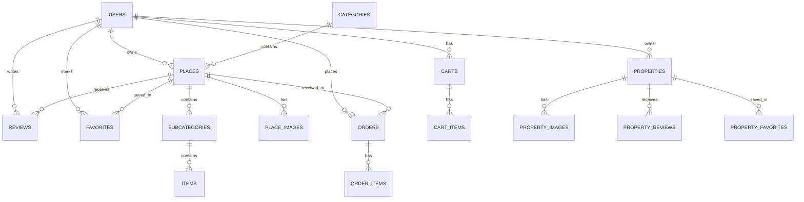

# 🏗️ AroundU – Database Architecture Design

دا توثيق كامل وشامل لتصميم قاعدة البيانات الخاصة بمشروع **AroundU**. التصميم معمول عشان يخدم الـ Scale العالي ويدعم الـ Features المختلفة زي الـ Places، الـ Menu Management، الـ AI Chatbot، ونظام الـ Orders.

---

## 🗺️ Entity Relationship Diagram (ERD)

---

## 📋 Table Definitions

### 1. الـ Core (Users & Auth)
دي الجداول الأساسية الخاصة بالمستخدمين والصلاحيات.

#### `users`
المسؤولة عن بيانات المستخدمين (Users, Owners, Admins).
| Column | Type | Description |
| :--- | :--- | :--- |
| `id` | Integer (PK) | المعرف الفريد للمستخدم |
| `firebase_uid` | String (Unique) | الـ ID الخاص بـ Firebase (للتسجيل بجوجل) |
| `full_name` | String | الاسم الكامل |
| `email` | String (Unique) | البريد الإلكتروني |
| `password_hash` | String | الباسورد المتشفر (Null في حالة Social Login) |
| `role` | String | الصلاحية (USER, OWNER, ADMIN) |
| `is_active` | Boolean | حالة الحساب |
| `is_verified` | Boolean | هل الحساب موثق؟ |
| `created_at` | Timestamptz | تاريخ الإنشاء |

---

### 2. الـ Discovery (Places & Categories)
دي الجداول الخاصة بالأماكن والمحلات والتقسيمات بتاعتها.

#### `places`
المسؤولة عن بيانات المحلات أو الأماكن.
| Column | Type | Description |
| :--- | :--- | :--- |
| `id` | Integer (PK) | المعرف الفريد للمكان |
| `name` | String | اسم المكان |
| `description` | Text | وصف المكان |
| `latitude` | Float | الإحداثيات (خط العرض) |
| `longitude` | Float | الإحداثيات (خط الطول) |
| `category_id` | Integer (FK) | تبع أنهي تصنيف أساسي |
| `owner_id` | Integer (FK) | مين صاحب المكان |
| `parent_id` | Integer (FK) | لو المكان دا "فرع" لمكان تاني |
| `rating` | Float | متوسط التقييم |

#### `categories`
التصنيفات الكبيرة (مطاعم، كافيهات، مستشفيات، إلخ).
| Column | Type | Description |
| :--- | :--- | :--- |
| `id` | Integer (PK) | المعرف الفريد |
| `name` | String | اسم التصنيف |
| `icon` | String | أيقونة التصنيف |

---

### 3. الـ Menu & Inventory (Items)
دي الجداول اللي بتتحكم في المنيو بتاع كل مكان.

#### `subcategories`
دي الأقسام جوه المنيو (مثلاً: مشروبات، بيتزا، مقبلات).
| Column | Type | Description |
| :--- | :--- | :--- |
| `id` | Integer (PK) | المعرف الفريد |
| `name` | String | اسم القسم |
| `place_id` | Integer (FK) | تابع لأنهي مكان |
| `owner_id` | Integer (FK) | صاحب القسم (للتأكد من الصلاحيات) |

#### `items`
الأصناف نفسها اللي بتتباع.
| Column | Type | Description |
| :--- | :--- | :--- |
| `id` | Integer (PK) | المعرف الفريد |
| `name` | String | اسم الصنف |
| `price` | Numeric | السعر |
| `image_url` | String | صورة الصنف |
| `sub_category_id` | Integer (FK) | تابع لأنهي قسم جوه المنيو |
| `is_available` | Boolean | هل متوفر حالياً؟ |

---

### 4. نظام الطلبات (Orders & Carts)
الجداول المسؤولة عن الـ Checkout والـ Cart.

#### `orders`
| Column | Type | Description |
| :--- | :--- | :--- |
| `id` | Integer (PK) | المعرف الفريد |
| `user_id` | Integer (FK) | المستخدم اللي طلب |
| `owner_id` | Integer (FK) | صاحب المكان اللي استلم الطلب |
| `place_id` | Integer (FK) | المكان اللي اطلب منه |
| `status` | String | حالة الطلب (PENDING, ACCEPTED, COMPLETED, CANCELLED) |
| `total_price` | Float | إجمالي السعر |

#### `order_items`
الأصناف اللي جوه كل أوردر.
| Column | Type | Description |
| :--- | :--- | :--- |
| `id` | Integer (PK) | المعرف الفريد |
| `order_id` | Integer (FK) | تابع لأنهي أوردر |
| `item_id` | Integer | ID الصنف |
| `quantity` | Integer | الكمية |
| `unit_price` | Float | سعر الوحدة وقت الطلب |

---

### 5. الـ Social (Reviews & Favorites)
التفاعل بين المستخدم والأماكن.

#### `reviews`
| Column | Type | Description |
| :--- | :--- | :--- |
| `id` | Integer (PK) | المعرف الفريد |
| `user_id` | Integer (FK) | مين اللي قيم |
| `place_id` | Integer (FK) | المكان اللي اتقيم |
| `rating` | Integer | التقييم (1-5) |
| `comment` | Text | التعليق |

---

### 6. الـ Housing (Properties)
دي الجداول الخاصة بالعقارات والسكن.

#### `properties`
| Column | Type | Description |
| :--- | :--- | :--- |
| `id` | Integer (PK) | المعرف الفريد |
| `title` | String | عنوان الإعلان |
| `price` | Float | السعر |
| `type` | String | النوع (Rent/Sale) |
| `latitude` / `longitude` | Float | الموقع الجغرافي |

---

### 7. الـ AI & Intelligence
الجداول اللي بتخزن تفاعلات الـ Chatbot والـ API Keys الخارجية.

#### `ai_interactions`
| Column | Type | Description |
| :--- | :--- | :--- |
| `id` | Integer (PK) | المعرف الفريد |
| `user_id` | Integer (FK) | المستخدم |
| `session_id` | String | معرف الجلسة |
| `message` | Text | رسالة المستخدم |
| `reply` | Text | رد الـ AI |
| `best_place` | JSONB | المكان اللي الـ AI رشحه |

---

## 🚀 Performance & Security Notes

1. **Indexing**: كل الـ Foreign Keys والـ Fields اللي بيتعمل عليها Search (زي `name`, `email`, `firebase_uid`) معمول لها Indexes عشان السرعة.
2. **Soft Deletes**: أغلب الجداول المهمة زي `users`, `items`, `subcategories` بتستخدم الـ Soft Delete (`is_deleted`) عشان منخسرش البيانات.
3. **Geo-Spatial Querying**: بنستخدم `GeoAlchemy2` و `Geography` (PostGIS) في جدول الـ `places` عشان نقدر نحسب المسافات بين المستخدم والأماكن بدقة وسرعة.
4. **Audit Logs**: فيه جدول `audit_logs` بيسجل أي عملية مهمة بتحصل في السيستم (زي تغيير حالة أوردر أو تعديل بيانات مكان).

---
*تم إعداد هذا المستند بواسطة Antigravity AI لمساعدة فريق التطوير.*
