# DB Class Diagram Reference — AroundU
> مرجع شامل لفريق قاعدة البيانات لرسم Class Diagrams و ERDs
> PostgreSQL + PostGIS | SQLAlchemy 2.0 | Alembic
> آخر تحديث: يونيو 2026

---

## جدول المحتويات
1. [نظرة عامة](#1-نظرة-عامة)
2. [Mermaid ERD — قابل للـ Render](#2-mermaid-erd--قابل-للـ-render)
3. [Auth Cluster — 6 جداول](#3-auth-cluster)
4. [Places & Menu Cluster — 6 جداول](#4-places--menu-cluster)
5. [Social Cluster — 2 جداول](#5-social-cluster)
6. [Real Estate Cluster — 4 جداول](#6-real-estate-cluster)
7. [Analytics & AI Cluster — 5 جداول](#7-analytics--ai-cluster)
8. [Notifications Cluster — 3 جداول](#8-notifications-cluster)
9. [E-Commerce Cluster — 4 جداول](#9-e-commerce-cluster)
10. [Search Cluster — 2 جداول](#10-search-cluster)
11. [جدول العلاقات الكامل](#11-جدول-العلاقات-الكامل)
12. [Enums Reference](#12-enums-reference)
13. [Constraints Reference](#13-constraints-reference)
14. [Indexes Reference](#14-indexes-reference)
15. [ملاحظات تصميمية مهمة للتيم](#15-ملاحظات-تصميمية-مهمة-للتيم)

---

## 1. نظرة عامة

| المعلومة | القيمة |
|---------|--------|
| **إجمالي الجداول** | 32 جدول |
| **إجمالي الأعمدة** | 298+ عمود |
| **قاعدة البيانات** | PostgreSQL |
| **امتداد Geospatial** | PostGIS — `geography(Point, 4326)` |
| **ORM** | SQLAlchemy 2.0 Declarative |
| **Migrations** | Alembic |
| **Full-Text Search** | TSVECTOR + GIN Index |
| **نوع الـ PK الأساسي** | SERIAL (Integer Auto-increment) |
| **نوع الـ PK الاستثنائي** | UUID — في `service_api_keys` و `password_reset_tokens` |
| **Soft Delete** | `users`, `subcategories`, `items`, `sub_items` |
| **Snapshot Pattern** | `order_items`, `cart_items` |

### مجموعات الجداول (Clusters)

| الـ Cluster | الجداول | العدد |
|------------|---------|-------|
| Auth | users, refresh_tokens, device_tokens, password_reset_tokens, audit_logs, service_api_keys | 6 |
| Places & Menu | categories, places, place_images, subcategories, items, sub_items | 6 |
| Social | reviews, favorites | 2 |
| Real Estate | properties, property_images, property_reviews, property_favorites | 4 |
| Analytics & AI | interactions, ai_interactions, chat_messages, conversations, messages | 5 |
| Notifications | notifications, notification_requests, notification_audits | 3 |
| E-Commerce | orders, order_items, carts, cart_items | 4 |
| Search | search_history, search_trends | 2 |

---

## 2. Mermaid ERD — قابل للـ Render

> يُعرض في: GitHub · VS Code (Mermaid extension) · Notion · draw.io (import) · mermaid.live

```mermaid
erDiagram

    %% ====== AUTH CLUSTER ======
    users {
        int id PK
        varchar firebase_uid UK
        varchar provider
        varchar full_name
        varchar email UK
        varchar password_hash
        varchar role
        varchar owner_type
        boolean is_active
        boolean is_verified
        boolean is_deleted
        timestamptz deleted_at
        varchar verification_token
        varchar reset_token
        timestamptz reset_token_expires
        timestamptz created_at
        timestamptz updated_at
    }

    refresh_tokens {
        int id PK
        int user_id FK
        int device_id FK
        varchar token_hash UK
        varchar family_id
        boolean is_revoked
        timestamptz expires_at
        timestamptz created_at
        timestamptz updated_at
    }

    device_tokens {
        int id PK
        int user_id FK
        varchar fcm_token UK
        varchar device_model
        varchar os_version
        varchar ip_address
        boolean is_active
        timestamptz last_active_at
        timestamptz created_at
    }

    password_reset_tokens {
        uuid id PK
        int user_id FK
        varchar token_hash UK
        timestamptz expires_at
        boolean is_used
        timestamptz created_at
    }

    audit_logs {
        int id PK
        int user_id FK
        varchar action
        varchar ip_address
        varchar device_info
        jsonb metadata_info
        timestamptz created_at
    }

    service_api_keys {
        uuid id PK
        varchar service_name
        varchar api_key_hash UK
        jsonb permissions
        jsonb allowed_ips
        boolean is_active
        timestamptz created_at
        timestamptz last_used_at
    }

    %% ====== PLACES & MENU CLUSTER ======
    categories {
        int id PK
        varchar name UK
        varchar icon
        timestamptz created_at
    }

    places {
        int id PK
        varchar name
        text description
        varchar address
        varchar_array phone
        varchar website
        varchar instagram_url
        varchar facebook_url
        varchar whatsapp_number
        varchar tiktok_url
        float rating
        int review_count
        int favorite_count
        tsvector search_vector
        float latitude
        float longitude
        geography location
        int category_id FK
        int owner_id FK
        int parent_id FK
        boolean is_active
        float delivery_price
        boolean is_free_delivery
        jsonb delivery_zones
        boolean is_accepting_orders
        boolean accepts_delivery
        boolean accepts_takeaway
        varchar working_hours
        timestamptz created_at
        timestamptz updated_at
    }

    place_images {
        int id PK
        int place_id FK
        varchar image_url
        varchar image_type
        text caption
        timestamptz created_at
    }

    subcategories {
        int id PK
        varchar name
        int place_id FK
        int owner_id FK
        boolean is_deleted
        timestamptz deleted_at
        timestamptz created_at
        timestamptz updated_at
    }

    items {
        int id PK
        varchar name
        text description
        numeric price
        varchar image_url
        boolean is_available
        int sub_category_id FK
        boolean is_deleted
        timestamptz deleted_at
        timestamptz created_at
        timestamptz updated_at
    }

    sub_items {
        int id PK
        varchar name
        text description
        numeric price
        boolean is_available
        int item_id FK
        boolean is_deleted
        timestamptz deleted_at
        timestamptz created_at
        timestamptz updated_at
    }

    %% ====== SOCIAL CLUSTER ======
    reviews {
        int id PK
        int user_id FK
        int place_id FK
        float rating
        text comment
        varchar sentiment
        timestamptz created_at
        timestamptz updated_at
    }

    favorites {
        int id PK
        int user_id FK
        int place_id FK
        timestamptz created_at
        timestamptz updated_at
    }

    %% ====== REAL ESTATE CLUSTER ======
    properties {
        int id PK
        varchar title
        text description
        float price
        float latitude
        float longitude
        varchar main_image_url
        varchar_array contact_number
        varchar whatsapp_number
        boolean is_available
        varchar owner_name
        int owner_id FK
        timestamptz created_at
        timestamptz updated_at
    }

    property_images {
        int id PK
        int property_id FK
        varchar image_url
        timestamptz created_at
    }

    property_reviews {
        int id PK
        int user_id FK
        int property_id FK
        float rating
        text comment
        timestamptz created_at
        timestamptz updated_at
    }

    property_favorites {
        int id PK
        int user_id FK
        int property_id FK
        timestamptz created_at
        timestamptz updated_at
    }

    %% ====== ANALYTICS & AI CLUSTER ======
    interactions {
        int id PK
        int user_id FK
        int place_id FK
        varchar type
        float user_lat
        float user_lon
        int cluster_id
        timestamptz created_at
    }

    ai_interactions {
        int id PK
        int user_id FK
        varchar session_id
        text message
        varchar message_source
        float user_lat
        float user_lon
        text reply
        varchar intent
        float confidence
        jsonb entities
        jsonb best_place
        int latency_ms
        int is_fallback
        timestamptz created_at
    }

    chat_messages {
        int id PK
        int user_id FK
        text message
        text reply
        timestamptz created_at
    }

    conversations {
        int id PK
        int user_id FK
        timestamptz created_at
    }

    messages {
        int id PK
        int conversation_id FK
        varchar sender
        text content
        timestamptz timestamp
    }

    %% ====== NOTIFICATIONS CLUSTER ======
    notifications {
        int id PK
        int user_id FK
        int request_id FK
        varchar title
        varchar message
        varchar type
        varchar priority
        boolean is_read
        jsonb data
        timestamptz created_at
    }

    notification_requests {
        int id PK
        int sender_id FK
        varchar target_type
        int target_user_id FK
        varchar title
        text message
        jsonb data
        varchar status
        boolean is_archived
        int approved_by FK
        timestamptz approved_at
        timestamptz created_at
    }

    notification_audits {
        int id PK
        int request_id FK
        int admin_id FK
        varchar action
        timestamptz timestamp
    }

    %% ====== E-COMMERCE CLUSTER ======
    orders {
        int id PK
        int user_id
        int place_id FK
        varchar order_type
        varchar status
        varchar full_name
        varchar phone_number
        varchar address
        varchar notes
        float total_price
        timestamptz created_at
    }

    order_items {
        int id PK
        int order_id FK
        int item_id
        int sub_item_id
        varchar item_name
        varchar image_url
        float unit_price
        int quantity
        float total_price
    }

    carts {
        int id PK
        int user_id
        int place_id FK
        float total_price
        timestamptz created_at
    }

    cart_items {
        int id PK
        int cart_id FK
        int item_id
        varchar item_name
        varchar image_url
        int quantity
        float unit_price
    }

    %% ====== SEARCH CLUSTER ======
    search_history {
        int id PK
        int user_id FK
        varchar query
        timestamptz created_at
        timestamptz updated_at
    }

    search_trends {
        varchar query PK
        int count
        timestamptz last_searched_at
    }

    %% ====== RELATIONSHIPS ======
    users ||--o{ refresh_tokens : "has"
    users ||--o{ device_tokens : "has"
    users ||--o{ password_reset_tokens : "has"
    users ||--o{ audit_logs : "logged in"
    users ||--o{ places : "owns"
    users ||--o{ subcategories : "owns"
    users ||--o{ reviews : "writes"
    users ||--o{ favorites : "has"
    users ||--o{ properties : "owns"
    users ||--o{ property_reviews : "writes"
    users ||--o{ property_favorites : "has"
    users ||--o{ interactions : "makes"
    users ||--o{ ai_interactions : "has"
    users ||--o{ chat_messages : "has"
    users ||--o{ conversations : "has"
    users ||--o{ search_history : "has"
    users ||--o{ notifications : "receives"
    users ||--o{ notification_requests : "sends"

    refresh_tokens }o--|| device_tokens : "linked to"

    categories ||--o{ places : "classifies"

    places ||--o{ place_images : "has"
    places ||--o{ subcategories : "has"
    places ||--o{ reviews : "receives"
    places ||--o{ favorites : "in"
    places ||--o{ interactions : "receives"
    places ||--o{ orders : "receives"
    places ||--o{ carts : "has"
    places ||--o{ places : "has branches"

    subcategories ||--o{ items : "contains"
    items ||--o{ sub_items : "has variants"

    properties ||--o{ property_images : "has"
    properties ||--o{ property_reviews : "receives"
    properties ||--o{ property_favorites : "in"

    conversations ||--o{ messages : "contains"

    notification_requests ||--o{ notifications : "generates"
    notification_requests ||--o{ notification_audits : "audited by"

    orders ||--o{ order_items : "contains"
    carts ||--o{ cart_items : "contains"
```



---

## 3. Auth Cluster

### 3.1 `users` — class: `User`
**ملف:** `src/models/user.py`

| # | العمود | نوع SQL | Nullable | Default | PK/FK | وصف |
|---|--------|---------|----------|---------|-------|-----|
| 1 | `id` | `SERIAL` (INTEGER) | NOT NULL | auto | **PK** | المعرف الرئيسي |
| 2 | `firebase_uid` | `VARCHAR` | NULL | — | UNIQUE | معرف Firebase للـ Google Auth |
| 3 | `provider` | `VARCHAR` | NULL | `'local'` | — | طريقة التسجيل: `local` / `google` |
| 4 | `full_name` | `VARCHAR` | NOT NULL | — | — | الاسم الكامل |
| 5 | `email` | `VARCHAR` | NULL | — | UNIQUE | البريد الإلكتروني (nullable لـ social auth) |
| 6 | `password_hash` | `VARCHAR` | NULL | — | — | كلمة المرور مشفرة bcrypt (nullable لـ social auth) |
| 7 | `role` | `VARCHAR` | NOT NULL | `'USER'` | — | الدور: `USER` / `OWNER` / `ADMIN` |
| 8 | `owner_type` | `VARCHAR` | NULL | — | — | نوع المالك: `COMMERCIAL` / `RESIDENTIAL` |
| 9 | `is_active` | `BOOLEAN` | NOT NULL | `TRUE` | — | هل الحساب مفعّل |
| 10 | `is_verified` | `BOOLEAN` | NOT NULL | `FALSE` | — | هل البريد الإلكتروني متحقق منه |
| 11 | `is_deleted` | `BOOLEAN` | NOT NULL | `FALSE` | — | **Soft Delete flag** |
| 12 | `deleted_at` | `TIMESTAMPTZ` | NULL | — | — | **Soft Delete timestamp** |
| 13 | `verification_token` | `VARCHAR` | NULL | — | — | رمز التحقق من البريد الإلكتروني |
| 14 | `reset_token` | `VARCHAR` | NULL | — | — | رمز استعادة كلمة المرور (قديم) |
| 15 | `reset_token_expires` | `TIMESTAMPTZ` | NULL | — | — | تاريخ انتهاء رمز الاستعادة القديم |
| 16 | `created_at` | `TIMESTAMPTZ` | NOT NULL | `NOW()` | — | تاريخ الإنشاء |
| 17 | `updated_at` | `TIMESTAMPTZ` | NULL | — | — | تاريخ آخر تعديل (auto on update) |

**Indexes:** `id` (PK), `email` (UNIQUE), `firebase_uid` (UNIQUE)

**العلاقات (1:N):** → refresh_tokens, device_tokens, password_reset_tokens, audit_logs, places, subcategories, reviews, favorites, properties, property_reviews, property_favorites, interactions, ai_interactions, chat_messages, conversations, search_history, notifications, notification_requests

---

### 3.2 `refresh_tokens` — class: `RefreshToken`
**ملف:** `src/models/token.py`

| # | العمود | نوع SQL | Nullable | Default | PK/FK | وصف |
|---|--------|---------|----------|---------|-------|-----|
| 1 | `id` | `SERIAL` | NOT NULL | auto | **PK** | المعرف |
| 2 | `user_id` | `INTEGER` | NOT NULL | — | **FK** → users.id CASCADE | المستخدم |
| 3 | `device_id` | `INTEGER` | NULL | — | **FK** → device_tokens.id SET NULL | الجهاز المرتبط |
| 4 | `token_hash` | `VARCHAR` | NOT NULL | — | UNIQUE, INDEX | SHA-256 hash للـ token |
| 5 | `family_id` | `VARCHAR` | NOT NULL | — | INDEX | مجموعة الـ tokens من نفس الجلسة |
| 6 | `is_revoked` | `BOOLEAN` | NOT NULL | `FALSE` | — | هل ملغي |
| 7 | `expires_at` | `TIMESTAMPTZ` | NOT NULL | — | — | تاريخ الانتهاء (30 يوم) |
| 8 | `created_at` | `TIMESTAMPTZ` | NOT NULL | `NOW()` | — | تاريخ الإنشاء |
| 9 | `updated_at` | `TIMESTAMPTZ` | NULL | — | — | تاريخ آخر تعديل |

**Indexes:** `user_id`, `token_hash` (UNIQUE), `family_id`

---

### 3.3 `device_tokens` — class: `DeviceToken`
**ملف:** `src/models/device.py`

| # | العمود | نوع SQL | Nullable | Default | PK/FK | وصف |
|---|--------|---------|----------|---------|-------|-----|
| 1 | `id` | `SERIAL` | NOT NULL | auto | **PK** | المعرف |
| 2 | `user_id` | `INTEGER` | NOT NULL | — | **FK** → users.id CASCADE | المستخدم |
| 3 | `fcm_token` | `VARCHAR` | NOT NULL | — | UNIQUE, INDEX | Firebase Cloud Messaging token |
| 4 | `device_model` | `VARCHAR` | NULL | — | — | موديل الجهاز (مثال: iPhone 14) |
| 5 | `os_version` | `VARCHAR` | NULL | — | — | إصدار نظام التشغيل |
| 6 | `ip_address` | `VARCHAR` | NULL | — | — | عنوان IP |
| 7 | `is_active` | `BOOLEAN` | NOT NULL | `TRUE` | — | هل الجهاز نشط |
| 8 | `last_active_at` | `TIMESTAMPTZ` | NOT NULL | `NOW()` | — | آخر وقت نشاط |
| 9 | `created_at` | `TIMESTAMPTZ` | NOT NULL | `NOW()` | — | تاريخ التسجيل |

**Indexes:** `user_id`, `fcm_token` (UNIQUE)

---

### 3.4 `password_reset_tokens` — class: `PasswordResetToken`
**ملف:** `src/models/password_reset_token.py`

| # | العمود | نوع SQL | Nullable | Default | PK/FK | وصف |
|---|--------|---------|----------|---------|-------|-----|
| 1 | `id` | `UUID` | NOT NULL | `gen_random_uuid()` | **PK** | UUID — صعب التخمين |
| 2 | `user_id` | `INTEGER` | NOT NULL | — | **FK** → users.id CASCADE | المستخدم |
| 3 | `token_hash` | `VARCHAR` | NOT NULL | — | UNIQUE, INDEX | هاش الرمز المرسل في الإيميل |
| 4 | `expires_at` | `TIMESTAMPTZ` | NOT NULL | — | — | تاريخ الانتهاء (30 دقيقة) |
| 5 | `is_used` | `BOOLEAN` | NOT NULL | `FALSE` | — | هل استُخدم (one-time use) |
| 6 | `created_at` | `TIMESTAMPTZ` | NOT NULL | `NOW()` | — | تاريخ الإنشاء |

**Indexes:** `user_id`, `token_hash` (UNIQUE)

---

### 3.5 `audit_logs` — class: `AuditLog`
**ملف:** `src/models/audit_log.py`

| # | العمود | نوع SQL | Nullable | Default | PK/FK | وصف |
|---|--------|---------|----------|---------|-------|-----|
| 1 | `id` | `SERIAL` | NOT NULL | auto | **PK** | المعرف |
| 2 | `user_id` | `INTEGER` | NULL | — | **FK** → users.id **SET NULL** | المستخدم (nullable — يصبح NULL لو المستخدم اتحذف) |
| 3 | `action` | `VARCHAR` | NOT NULL | — | INDEX | الإجراء: `login`, `password_reset`, `logout`, ... |
| 4 | `ip_address` | `VARCHAR` | NULL | — | — | عنوان IP |
| 5 | `device_info` | `VARCHAR` | NULL | — | — | معلومات الجهاز |
| 6 | `metadata_info` | `JSONB` | NULL | — | — | بيانات إضافية خاصة بكل حدث |
| 7 | `created_at` | `TIMESTAMPTZ` | NOT NULL | `NOW()` | — | تاريخ الحدث |

**Indexes:** `user_id`, `action`

**ملاحظة مهمة:** `user_id` يستخدم `SET NULL` مش `CASCADE` — السجلات التاريخية تبقى حتى لو المستخدم اتحذف.

---

### 3.6 `service_api_keys` — class: `ServiceAPIKey`
**ملف:** `src/models/api_key.py`

| # | العمود | نوع SQL | Nullable | Default | PK/FK | وصف |
|---|--------|---------|----------|---------|-------|-----|
| 1 | `id` | `UUID` | NOT NULL | `gen_random_uuid()` | **PK** | UUID |
| 2 | `service_name` | `VARCHAR` | NOT NULL | — | — | اسم الخدمة الخارجية (مثال: ai_service) |
| 3 | `api_key_hash` | `VARCHAR` | NOT NULL | — | UNIQUE, INDEX | SHA-256 hash للمفتاح |
| 4 | `permissions` | `JSONB` | NOT NULL | — | — | مثال: `["read:places", "read:interactions"]` |
| 5 | `allowed_ips` | `JSONB` | NULL | — | — | قائمة IPs المسموحة `["1.2.3.4"]` |
| 6 | `is_active` | `BOOLEAN` | NOT NULL | `TRUE` | — | هل المفتاح نشط |
| 7 | `created_at` | `TIMESTAMPTZ` | NOT NULL | `NOW()` | — | تاريخ الإنشاء |
| 8 | `last_used_at` | `TIMESTAMPTZ` | NULL | — | — | آخر استخدام |

**Indexes:** `api_key_hash` (UNIQUE)

**ملاحظة:** لا يرتبط بجدول `users` — مخصص للخدمات الخارجية (AI microservice).

---

## 4. Places & Menu Cluster

### 4.1 `categories` — class: `Category`
**ملف:** `src/models/category.py`

| # | العمود | نوع SQL | Nullable | Default | PK/FK | وصف |
|---|--------|---------|----------|---------|-------|-----|
| 1 | `id` | `SERIAL` | NOT NULL | auto | **PK**, INDEX | المعرف |
| 2 | `name` | `VARCHAR` | NOT NULL | — | UNIQUE, INDEX | اسم الفئة (مثال: مطاعم، مقاهي) |
| 3 | `icon` | `VARCHAR` | NULL | — | — | أيقونة: URL أو emoji |
| 4 | `created_at` | `TIMESTAMPTZ` | NOT NULL | `NOW()` | — | تاريخ الإنشاء |

---

### 4.2 `places` — class: `Place`
**ملف:** `src/models/place.py` ⭐ أكبر جدول

| # | العمود | نوع SQL | Nullable | Default | PK/FK | وصف |
|---|--------|---------|----------|---------|-------|-----|
| 1 | `id` | `SERIAL` | NOT NULL | auto | **PK**, INDEX | المعرف |
| 2 | `name` | `VARCHAR` | NOT NULL | — | INDEX | اسم المكان |
| 3 | `description` | `TEXT` | NULL | — | — | وصف المكان |
| 4 | `address` | `VARCHAR` | NULL | — | — | العنوان النصي |
| 5 | `phone` | `VARCHAR[]` | NULL | — | — | **ARRAY** من أرقام الهاتف |
| 6 | `website` | `VARCHAR` | NULL | — | — | رابط الموقع الإلكتروني |
| 7 | `instagram_url` | `VARCHAR` | NULL | — | — | رابط Instagram |
| 8 | `facebook_url` | `VARCHAR` | NULL | — | — | رابط Facebook |
| 9 | `whatsapp_number` | `VARCHAR` | NULL | — | — | رقم WhatsApp |
| 10 | `tiktok_url` | `VARCHAR` | NULL | — | — | رابط TikTok |
| 11 | `rating` | `FLOAT` | NOT NULL | `0.0` | — | متوسط التقييم `[0.0 – 5.0]` |
| 12 | `review_count` | `INTEGER` | NOT NULL | `0` | — | عدد التقييمات (denormalized counter) |
| 13 | `favorite_count` | `INTEGER` | NOT NULL | `0` | — | عدد المفضلة (denormalized counter) |
| 14 | `search_vector` | `TSVECTOR` | NULL | — | — | بيانات الـ Full-Text Search (auto-managed) |
| 15 | `latitude` | `FLOAT` | NOT NULL | — | — | خط العرض `[-90, 90]` |
| 16 | `longitude` | `FLOAT` | NOT NULL | — | — | خط الطول `[-180, 180]` |
| 17 | `location` | `geography(POINT, 4326)` | NULL | — | — | **PostGIS** نقطة جغرافية WGS-84 |
| 18 | `category_id` | `INTEGER` | NOT NULL | — | **FK** → categories.id | الفئة |
| 19 | `owner_id` | `INTEGER` | NOT NULL | — | **FK** → users.id CASCADE, INDEX | المالك |
| 20 | `parent_id` | `INTEGER` | NULL | — | **FK** → places.id SET NULL, INDEX | **Self-ref** — الفرع الأصلي (`NULL` = مكان رئيسي) |
| 21 | `is_active` | `BOOLEAN` | NOT NULL | `TRUE` | — | هل المكان مفعّل |
| 22 | `delivery_price` | `FLOAT` | NOT NULL | `0.0` | — | سعر التوصيل |
| 23 | `is_free_delivery` | `BOOLEAN` | NOT NULL | `FALSE` | — | توصيل مجاني |
| 24 | `delivery_zones` | `JSONB` | NULL | — | — | مناطق التوصيل (هيكل مرن) |
| 25 | `is_accepting_orders` | `BOOLEAN` | NOT NULL | `TRUE` | — | يقبل الأوردرات حالياً |
| 26 | `accepts_delivery` | `BOOLEAN` | NOT NULL | `TRUE` | — | يقبل الـ Delivery |
| 27 | `accepts_takeaway` | `BOOLEAN` | NOT NULL | `TRUE` | — | يقبل الـ Takeaway |
| 28 | `working_hours` | `VARCHAR` | NULL | — | — | مثال: `"9:00 AM - 11:00 PM"` |
| 29 | `created_at` | `TIMESTAMPTZ` | NOT NULL | `NOW()` | — | تاريخ الإنشاء |
| 30 | `updated_at` | `TIMESTAMPTZ` | NULL | — | — | تاريخ آخر تعديل |

**Check Constraints:**
- `check_latitude_range`: `latitude >= -90 AND latitude <= 90`
- `check_longitude_range`: `longitude >= -180 AND longitude <= 180`
- `check_rating_range`: `rating >= 0 AND rating <= 5`

**Indexes:** `name` (btree), `owner_id` (btree), `parent_id` (btree), `location` (**GiST** — PostGIS), `search_vector` (**GIN** — FTS)

---

### 4.3 `place_images` — class: `PlaceImage`
**ملف:** `src/models/place_image.py`

| # | العمود | نوع SQL | Nullable | Default | PK/FK | وصف |
|---|--------|---------|----------|---------|-------|-----|
| 1 | `id` | `SERIAL` | NOT NULL | auto | **PK** | المعرف |
| 2 | `place_id` | `INTEGER` | NOT NULL | — | **FK** → places.id CASCADE, INDEX | المكان |
| 3 | `image_url` | `VARCHAR` | NOT NULL | — | — | رابط الصورة (Cloudinary URL) |
| 4 | `image_type` | `VARCHAR(20)` | NOT NULL | — | — | نوع الصورة: `place` / `menu` |
| 5 | `caption` | `TEXT` | NULL | — | — | وصف الصورة |
| 6 | `created_at` | `TIMESTAMPTZ` | NOT NULL | `NOW()` | — | تاريخ الرفع |

---

### 4.4 `subcategories` — class: `SubCategory`
**ملف:** `src/models/subcategory.py`

| # | العمود | نوع SQL | Nullable | Default | PK/FK | وصف |
|---|--------|---------|----------|---------|-------|-----|
| 1 | `id` | `SERIAL` | NOT NULL | auto | **PK** | المعرف |
| 2 | `name` | `VARCHAR` | NOT NULL | — | INDEX | اسم التصنيف الفرعي في القائمة |
| 3 | `place_id` | `INTEGER` | NOT NULL | — | **FK** → places.id CASCADE | المكان المالك |
| 4 | `owner_id` | `INTEGER` | NOT NULL | — | **FK** → users.id CASCADE | المالك |
| 5 | `is_deleted` | `BOOLEAN` | NOT NULL | `FALSE` | — | **Soft Delete flag** |
| 6 | `deleted_at` | `TIMESTAMPTZ` | NULL | — | — | **Soft Delete timestamp** |
| 7 | `created_at` | `TIMESTAMPTZ` | NOT NULL | `NOW()` | — | تاريخ الإنشاء |
| 8 | `updated_at` | `TIMESTAMPTZ` | NULL | — | — | تاريخ آخر تعديل |

**Indexes:** `name`, `place_id`

---

### 4.5 `items` — class: `Item`
**ملف:** `src/models/item.py`

| # | العمود | نوع SQL | Nullable | Default | PK/FK | وصف |
|---|--------|---------|----------|---------|-------|-----|
| 1 | `id` | `SERIAL` | NOT NULL | auto | **PK** | المعرف |
| 2 | `name` | `VARCHAR` | NOT NULL | — | INDEX | اسم العنصر في القائمة |
| 3 | `description` | `TEXT` | NULL | — | — | الوصف |
| 4 | `price` | `NUMERIC(10, 2)` | NOT NULL | — | — | السعر بدقة عشرية (10 أرقام، رقمين عشريين) |
| 5 | `image_url` | `VARCHAR` | NULL | — | — | رابط صورة العنصر |
| 6 | `is_available` | `BOOLEAN` | NOT NULL | `TRUE` | — | متاح للطلب |
| 7 | `sub_category_id` | `INTEGER` | NOT NULL | — | **FK** → subcategories.id CASCADE, INDEX | التصنيف الفرعي |
| 8 | `is_deleted` | `BOOLEAN` | NOT NULL | `FALSE` | — | **Soft Delete flag** |
| 9 | `deleted_at` | `TIMESTAMPTZ` | NULL | — | — | **Soft Delete timestamp** |
| 10 | `created_at` | `TIMESTAMPTZ` | NOT NULL | `NOW()` | — | تاريخ الإنشاء |
| 11 | `updated_at` | `TIMESTAMPTZ` | NULL | — | — | تاريخ آخر تعديل |

**Indexes:** `name`, `sub_category_id`

---

### 4.6 `sub_items` — class: `SubItem`
**ملف:** `src/models/sub_item.py`

> الـ Sub-items هي variants للعناصر: مثل "Large"، "Extra Cheese"، "Without Sugar"

| # | العمود | نوع SQL | Nullable | Default | PK/FK | وصف |
|---|--------|---------|----------|---------|-------|-----|
| 1 | `id` | `SERIAL` | NOT NULL | auto | **PK** | المعرف |
| 2 | `name` | `VARCHAR` | NOT NULL | — | — | الاسم (مثال: Large, Extra Cheese) |
| 3 | `description` | `TEXT` | NULL | — | — | الوصف |
| 4 | `price` | `NUMERIC(10, 2)` | NOT NULL | — | — | السعر |
| 5 | `is_available` | `BOOLEAN` | NOT NULL | `TRUE` | — | متاح |
| 6 | `item_id` | `INTEGER` | NOT NULL | — | **FK** → items.id CASCADE | العنصر الأصلي |
| 7 | `is_deleted` | `BOOLEAN` | NOT NULL | `FALSE` | — | **Soft Delete flag** |
| 8 | `deleted_at` | `TIMESTAMPTZ` | NULL | — | — | **Soft Delete timestamp** |
| 9 | `created_at` | `TIMESTAMPTZ` | NOT NULL | `NOW()` | — | تاريخ الإنشاء |
| 10 | `updated_at` | `TIMESTAMPTZ` | NULL | — | — | تاريخ آخر تعديل |

---

## 5. Social Cluster

### 5.1 `reviews` — class: `Review`
**ملف:** `src/models/review.py`

| # | العمود | نوع SQL | Nullable | Default | PK/FK | وصف |
|---|--------|---------|----------|---------|-------|-----|
| 1 | `id` | `SERIAL` | NOT NULL | auto | **PK** | المعرف |
| 2 | `user_id` | `INTEGER` | NOT NULL | — | **FK** → users.id CASCADE, INDEX | المستخدم |
| 3 | `place_id` | `INTEGER` | NOT NULL | — | **FK** → places.id CASCADE, INDEX | المكان |
| 4 | `rating` | `FLOAT` | NOT NULL | — | — | التقييم `[1.0 – 5.0]` |
| 5 | `comment` | `TEXT` | NULL | — | — | نص التعليق |
| 6 | `sentiment` | `VARCHAR(20)` | NULL | — | — | تحليل المشاعر: `positive` / `negative` / `neutral` |
| 7 | `created_at` | `TIMESTAMPTZ` | NOT NULL | `NOW()` | — | تاريخ الإنشاء |
| 8 | `updated_at` | `TIMESTAMPTZ` | NULL | — | — | تاريخ آخر تعديل |

**Check Constraints:** `check_review_rating_range`: `rating >= 1 AND rating <= 5`

**Indexes:** `user_id`, `place_id`

---

### 5.2 `favorites` — class: `Favorite`
**ملف:** `src/models/favorite.py`

| # | العمود | نوع SQL | Nullable | Default | PK/FK | وصف |
|---|--------|---------|----------|---------|-------|-----|
| 1 | `id` | `SERIAL` | NOT NULL | auto | **PK** | المعرف |
| 2 | `user_id` | `INTEGER` | NOT NULL | — | **FK** → users.id CASCADE | المستخدم |
| 3 | `place_id` | `INTEGER` | NOT NULL | — | **FK** → places.id CASCADE | المكان |
| 4 | `created_at` | `TIMESTAMPTZ` | NOT NULL | `NOW()` | — | تاريخ الإضافة |
| 5 | `updated_at` | `TIMESTAMPTZ` | NULL | — | — | تاريخ التعديل |

**Unique Constraint:** `unique_user_place_favorite` → `(user_id, place_id)` — مستخدم لا يضيف نفس المكان مرتين.

---

## 6. Real Estate Cluster

### 6.1 `properties` — class: `Property`
**ملف:** `src/models/property.py`

| # | العمود | نوع SQL | Nullable | Default | PK/FK | وصف |
|---|--------|---------|----------|---------|-------|-----|
| 1 | `id` | `SERIAL` | NOT NULL | auto | **PK** | المعرف |
| 2 | `title` | `VARCHAR` | NOT NULL | — | INDEX | عنوان العقار |
| 3 | `description` | `TEXT` | NULL | — | — | الوصف |
| 4 | `price` | `FLOAT` | NOT NULL | — | INDEX | السعر |
| 5 | `latitude` | `FLOAT` | NOT NULL | — | — | خط العرض |
| 6 | `longitude` | `FLOAT` | NOT NULL | — | — | خط الطول |
| 7 | `main_image_url` | `VARCHAR` | NULL | — | — | رابط الصورة الرئيسية |
| 8 | `contact_number` | `VARCHAR[]` | NULL | — | — | **ARRAY** من أرقام التواصل |
| 9 | `whatsapp_number` | `VARCHAR` | NULL | — | — | رقم WhatsApp |
| 10 | `is_available` | `BOOLEAN` | NOT NULL | `TRUE` | — | متاح للبيع/الإيجار |
| 11 | `owner_name` | `VARCHAR` | NULL | — | — | اسم المالك الحقيقي (قد يختلف عن المستخدم) |
| 12 | `owner_id` | `INTEGER` | NOT NULL | — | **FK** → users.id CASCADE, INDEX | المستخدم المالك في النظام |
| 13 | `created_at` | `TIMESTAMPTZ` | NOT NULL | `NOW()` | — | تاريخ الإنشاء |
| 14 | `updated_at` | `TIMESTAMPTZ` | NOT NULL | `NOW()` | — | تاريخ آخر تعديل |

**Indexes:** `title`, `price`, `owner_id`

---

### 6.2 `property_images` — class: `PropertyImage`
**ملف:** `src/models/property_image.py`

| # | العمود | نوع SQL | Nullable | Default | PK/FK | وصف |
|---|--------|---------|----------|---------|-------|-----|
| 1 | `id` | `SERIAL` | NOT NULL | auto | **PK** | المعرف |
| 2 | `property_id` | `INTEGER` | NOT NULL | — | **FK** → properties.id CASCADE, INDEX | العقار |
| 3 | `image_url` | `VARCHAR` | NOT NULL | — | — | رابط الصورة |
| 4 | `created_at` | `TIMESTAMPTZ` | NOT NULL | `NOW()` | — | تاريخ الرفع |

---

### 6.3 `property_reviews` — class: `PropertyReview`
**ملف:** `src/models/property_review.py`

| # | العمود | نوع SQL | Nullable | Default | PK/FK | وصف |
|---|--------|---------|----------|---------|-------|-----|
| 1 | `id` | `SERIAL` | NOT NULL | auto | **PK** | المعرف |
| 2 | `user_id` | `INTEGER` | NOT NULL | — | **FK** → users.id CASCADE | المستخدم |
| 3 | `property_id` | `INTEGER` | NOT NULL | — | **FK** → properties.id CASCADE | العقار |
| 4 | `rating` | `FLOAT` | NOT NULL | — | — | التقييم `[1.0 – 5.0]` |
| 5 | `comment` | `TEXT` | NULL | — | — | التعليق |
| 6 | `created_at` | `TIMESTAMPTZ` | NOT NULL | `NOW()` | — | تاريخ الإنشاء |
| 7 | `updated_at` | `TIMESTAMPTZ` | NULL | — | — | تاريخ آخر تعديل |

**Check Constraints:** `check_property_review_rating_range`: `rating >= 1 AND rating <= 5`

---

### 6.4 `property_favorites` — class: `PropertyFavorite`
**ملف:** `src/models/property_favorite.py`

| # | العمود | نوع SQL | Nullable | Default | PK/FK | وصف |
|---|--------|---------|----------|---------|-------|-----|
| 1 | `id` | `SERIAL` | NOT NULL | auto | **PK** | المعرف |
| 2 | `user_id` | `INTEGER` | NOT NULL | — | **FK** → users.id CASCADE | المستخدم |
| 3 | `property_id` | `INTEGER` | NOT NULL | — | **FK** → properties.id CASCADE | العقار |
| 4 | `created_at` | `TIMESTAMPTZ` | NOT NULL | `NOW()` | — | تاريخ الإضافة |
| 5 | `updated_at` | `TIMESTAMPTZ` | NULL | — | — | تاريخ التعديل |

**Unique Constraint:** `unique_user_property_favorite` → `(user_id, property_id)`

---

## 7. Analytics & AI Cluster

### 7.1 `interactions` — class: `Interaction`
**ملف:** `src/models/interaction.py`

| # | العمود | نوع SQL | Nullable | Default | PK/FK | وصف |
|---|--------|---------|----------|---------|-------|-----|
| 1 | `id` | `SERIAL` | NOT NULL | auto | **PK** | المعرف |
| 2 | `user_id` | `INTEGER` | **NULL** | — | **FK** → users.id CASCADE (nullable) | المستخدم — **nullable** لدعم الزوار المجهولين |
| 3 | `place_id` | `INTEGER` | NOT NULL | — | **FK** → places.id CASCADE | المكان |
| 4 | `type` | `VARCHAR` | NOT NULL | — | — | نوع التفاعل (انظر Enum) |
| 5 | `user_lat` | `FLOAT` | NULL | — | — | موقع المستخدم — خط العرض |
| 6 | `user_lon` | `FLOAT` | NULL | — | — | موقع المستخدم — خط الطول |
| 7 | `cluster_id` | `INTEGER` | NULL | — | — | مجموعة تجميع ML للمواقع |
| 8 | `created_at` | `TIMESTAMPTZ` | NOT NULL | `NOW()` | — | تاريخ التفاعل |

**InteractionType Enum:** `visit` / `call` / `direction` / `order` / `save`

---

### 7.2 `ai_interactions` — class: `AIInteraction`
**ملف:** `src/models/ai_interaction.py`

| # | العمود | نوع SQL | Nullable | Default | PK/FK | وصف |
|---|--------|---------|----------|---------|-------|-----|
| 1 | `id` | `SERIAL` | NOT NULL | auto | **PK** | المعرف |
| 2 | `user_id` | `INTEGER` | NOT NULL | — | **FK** → users.id CASCADE, INDEX | المستخدم |
| 3 | `session_id` | `VARCHAR(64)` | NOT NULL | — | INDEX | معرف الجلسة (UUID string) |
| 4 | `message` | `TEXT` | NOT NULL | — | — | رسالة المستخدم |
| 5 | `message_source` | `VARCHAR(10)` | NULL | `'text'` | — | مصدر الرسالة: `text` / `voice` |
| 6 | `user_lat` | `FLOAT` | NULL | — | — | موقع المستخدم — خط العرض |
| 7 | `user_lon` | `FLOAT` | NULL | — | — | موقع المستخدم — خط الطول |
| 8 | `reply` | `TEXT` | NULL | — | — | رد الـ AI |
| 9 | `intent` | `VARCHAR(128)` | NULL | — | — | نية المستخدم المستخرجة |
| 10 | `confidence` | `FLOAT` | NULL | — | — | درجة الثقة `[0.0 – 1.0]` |
| 11 | `entities` | `JSONB` | NULL | — | — | كيانات مستخرجة من الرسالة (NLP) |
| 12 | `best_place` | `JSONB` | NULL | — | — | أفضل مكان مقترح من الـ AI |
| 13 | `latency_ms` | `INTEGER` | NULL | — | — | زمن استجابة الـ AI بالميلي ثانية |
| 14 | `is_fallback` | `INTEGER` | NOT NULL | `0` | — | `1` إذا كان الـ AI غير متاح وتم الـ fallback |
| 15 | `created_at` | `TIMESTAMPTZ` | NOT NULL | `NOW()` | INDEX | تاريخ الإنشاء |

**Indexes:** `user_id`, `session_id`, `created_at`

---

### 7.3 `chat_messages` — class: `ChatMessage`
**ملف:** `src/models/chat_message.py`

> **ملاحظة:** هذا الجدول Legacy — الجديد هو `conversations` + `messages`

| # | العمود | نوع SQL | Nullable | Default | PK/FK | وصف |
|---|--------|---------|----------|---------|-------|-----|
| 1 | `id` | `SERIAL` | NOT NULL | auto | **PK** | المعرف |
| 2 | `user_id` | `INTEGER` | NOT NULL | — | **FK** → users.id CASCADE | المستخدم |
| 3 | `message` | `TEXT` | NOT NULL | — | — | رسالة المستخدم |
| 4 | `reply` | `TEXT` | NOT NULL | — | — | رد الـ AI |
| 5 | `created_at` | `TIMESTAMPTZ` | NOT NULL | `NOW()` | — | تاريخ الإنشاء |

---

### 7.4 `conversations` — class: `Conversation`
**ملف:** `src/models/conversation.py`

| # | العمود | نوع SQL | Nullable | Default | PK/FK | وصف |
|---|--------|---------|----------|---------|-------|-----|
| 1 | `id` | `SERIAL` | NOT NULL | auto | **PK** | المعرف |
| 2 | `user_id` | `INTEGER` | NOT NULL | — | **FK** → users.id CASCADE | المستخدم |
| 3 | `created_at` | `TIMESTAMPTZ` | NOT NULL | `NOW()` | — | تاريخ الإنشاء |

---

### 7.5 `messages` — class: `Message`
**ملف:** `src/models/message.py`

| # | العمود | نوع SQL | Nullable | Default | PK/FK | وصف |
|---|--------|---------|----------|---------|-------|-----|
| 1 | `id` | `SERIAL` | NOT NULL | auto | **PK** | المعرف |
| 2 | `conversation_id` | `INTEGER` | NOT NULL | — | **FK** → conversations.id CASCADE | المحادثة |
| 3 | `sender` | `VARCHAR` | NOT NULL | — | — | المرسل: `user` / `ai` |
| 4 | `content` | `TEXT` | NOT NULL | — | — | محتوى الرسالة |
| 5 | `timestamp` | `TIMESTAMPTZ` | NOT NULL | `NOW()` | — | وقت الإرسال |

---

## 8. Notifications Cluster

### 8.1 `notifications` — class: `Notification`
**ملف:** `src/models/notification.py`

| # | العمود | نوع SQL | Nullable | Default | PK/FK | وصف |
|---|--------|---------|----------|---------|-------|-----|
| 1 | `id` | `SERIAL` | NOT NULL | auto | **PK** | المعرف |
| 2 | `user_id` | `INTEGER` | NOT NULL | — | **FK** → users.id CASCADE | المستخدم المستقبِل |
| 3 | `request_id` | `INTEGER` | NULL | — | **FK** → notification_requests.id **SET NULL** | الطلب المصدر (nullable) |
| 4 | `title` | `VARCHAR` | NOT NULL | — | — | عنوان الإشعار |
| 5 | `message` | `VARCHAR` | NOT NULL | — | — | نص الإشعار |
| 6 | `type` | `VARCHAR` | NOT NULL | — | — | نوع الإشعار (انظر Enum) |
| 7 | `priority` | `VARCHAR` | NOT NULL | `'NORMAL'` | — | الأولوية: `HIGH` / `NORMAL` |
| 8 | `is_read` | `BOOLEAN` | NOT NULL | `FALSE` | — | هل قُرئ |
| 9 | `data` | `JSONB` | NULL | — | — | بيانات إضافية: `{place_id, order_id, ...}` |
| 10 | `created_at` | `TIMESTAMPTZ` | NOT NULL | `NOW()` | INDEX | تاريخ الإنشاء |

**Indexes:**
- `(user_id, is_read)` composite — لجلب الإشعارات غير المقروءة
- `created_at DESC` — للترتيب الزمني

---

### 8.2 `notification_requests` — class: `NotificationRequest`
**ملف:** `src/models/notification_request.py`

> جدول workflow الموافقة — الأدمن يوافق قبل إرسال الإشعارات الجماعية

| # | العمود | نوع SQL | Nullable | Default | PK/FK | وصف |
|---|--------|---------|----------|---------|-------|-----|
| 1 | `id` | `SERIAL` | NOT NULL | auto | **PK** | المعرف |
| 2 | `sender_id` | `INTEGER` | NOT NULL | — | **FK** → users.id CASCADE | المرسِل (Owner يطلب الإرسال) |
| 3 | `target_type` | `VARCHAR` | NOT NULL | — | — | نوع الهدف (انظر Enum) |
| 4 | `target_user_id` | `INTEGER` | NULL | — | **FK** → users.id CASCADE (nullable) | المستخدم المستهدف (عند SPECIFIC_USER/OWNER) |
| 5 | `title` | `VARCHAR` | NOT NULL | — | — | عنوان الإشعار |
| 6 | `message` | `TEXT` | NOT NULL | — | — | نص الإشعار |
| 7 | `data` | `JSONB` | NULL | — | — | بيانات إضافية |
| 8 | `status` | `VARCHAR` | NOT NULL | `'PENDING'` | — | الحالة (انظر Enum) |
| 9 | `is_archived` | `BOOLEAN` | NOT NULL | `FALSE` | — | هل محفوظ في الأرشيف |
| 10 | `approved_by` | `INTEGER` | NULL | — | **FK** → users.id **SET NULL** (nullable) | الأدمن الذي وافق |
| 11 | `approved_at` | `TIMESTAMPTZ` | NULL | — | — | تاريخ الموافقة/الرفض |
| 12 | `created_at` | `TIMESTAMPTZ` | NOT NULL | `NOW()` | — | تاريخ الطلب |

**ملاحظة مهمة:** هذا الجدول له **3 FKs مختلفة** تشير لجدول `users`:
- `sender_id` → المرسِل (CASCADE)
- `target_user_id` → المستهدف (CASCADE, nullable)
- `approved_by` → الموافق (SET NULL, nullable)

---

### 8.3 `notification_audits` — class: `NotificationAudit`
**ملف:** `src/models/notification_audit.py`

| # | العمود | نوع SQL | Nullable | Default | PK/FK | وصف |
|---|--------|---------|----------|---------|-------|-----|
| 1 | `id` | `SERIAL` | NOT NULL | auto | **PK** | المعرف |
| 2 | `request_id` | `INTEGER` | NOT NULL | — | **FK** → notification_requests.id CASCADE | الطلب |
| 3 | `admin_id` | `INTEGER` | NOT NULL | — | **FK** → users.id CASCADE | الأدمن المنفِّذ |
| 4 | `action` | `VARCHAR` | NOT NULL | — | — | الإجراء: `APPROVED` / `REJECTED` |
| 5 | `timestamp` | `TIMESTAMPTZ` | NOT NULL | `NOW()` | — | وقت الإجراء |

---

## 9. E-Commerce Cluster

> **تنبيه مهم للتيم:** جداول هذا الـ Cluster في `app/orders/` تعمل مع Async database session منفصلة عن `src/`. الـ `user_id` في `orders` و`carts` **لا يوجد له FK** بالقصد — التحقق يتم في الـ Service Layer.

### 9.1 `orders` — class: `Order`
**ملف:** `app/orders/models/order_models.py`

| # | العمود | نوع SQL | Nullable | Default | PK/FK | وصف |
|---|--------|---------|----------|---------|-------|-----|
| 1 | `id` | `SERIAL` | NOT NULL | auto | **PK** | المعرف |
| 2 | `user_id` | `INTEGER` | NOT NULL | — | ⚠️ **لا FK** (intentional), INDEX | المستخدم (مرجع بدون FK) |
| 3 | `place_id` | `INTEGER` | NULL | — | **FK** → places.id **SET NULL**, INDEX | المكان (يصبح NULL لو المكان اتحذف) |
| 4 | `order_type` | `VARCHAR(50)` | NOT NULL | — | — | `CASH_ON_DELIVERY` / `TAKE_AWAY` |
| 5 | `status` | `VARCHAR(50)` | NOT NULL | `'PENDING'` | — | حالة الأوردر (انظر Enum) |
| 6 | `full_name` | `VARCHAR` | NOT NULL | — | — | اسم المستلم |
| 7 | `phone_number` | `VARCHAR` | NOT NULL | — | — | رقم الهاتف |
| 8 | `address` | `VARCHAR` | NULL | — | — | عنوان التوصيل (مطلوب للـ Delivery) |
| 9 | `notes` | `VARCHAR` | NULL | — | — | ملاحظات إضافية |
| 10 | `total_price` | `FLOAT` | NOT NULL | `0.0` | — | الإجمالي |
| 11 | `created_at` | `TIMESTAMPTZ` | NOT NULL | `NOW()` | — | تاريخ الأوردر |

**Indexes:** `user_id`, `place_id`

**Order Status Flow:**
```
PENDING → CONFIRMED → PREPARING → READY_FOR_PICKUP → OUT_FOR_DELIVERY → COMPLETED
    ↘                                                                      ↙
                              CANCELLED (من أي حالة)
```

---

### 9.2 `order_items` — class: `OrderItem`
**ملف:** `app/orders/models/order_models.py`

> **Snapshot Pattern:** البيانات محفوظة وقت الشراء — لا FKs لجداول `items`/`sub_items` بالقصد

| # | العمود | نوع SQL | Nullable | Default | PK/FK | وصف |
|---|--------|---------|----------|---------|-------|-----|
| 1 | `id` | `SERIAL` | NOT NULL | auto | **PK** | المعرف |
| 2 | `order_id` | `INTEGER` | NOT NULL | — | **FK** → orders.id CASCADE | الأوردر |
| 3 | `item_id` | `INTEGER` | NULL | — | ⚠️ **لا FK** — Snapshot reference | معرف العنصر (للمرجعية فقط) |
| 4 | `sub_item_id` | `INTEGER` | NULL | — | ⚠️ **لا FK** — Snapshot reference | معرف الـ variant (اختياري) |
| 5 | `item_name` | `VARCHAR` | NOT NULL | — | — | اسم العنصر **محفوظ وقت الشراء** |
| 6 | `image_url` | `VARCHAR` | NULL | — | — | صورة العنصر **محفوظة وقت الشراء** |
| 7 | `unit_price` | `FLOAT` | NOT NULL | — | — | سعر الوحدة **وقت الشراء** |
| 8 | `quantity` | `INTEGER` | NOT NULL | — | — | الكمية |
| 9 | `total_price` | `FLOAT` | NOT NULL | — | — | الإجمالي = unit_price × quantity |

---

### 9.3 `carts` — class: `Cart`
**ملف:** `app/orders/models/cart.py`

| # | العمود | نوع SQL | Nullable | Default | PK/FK | وصف |
|---|--------|---------|----------|---------|-------|-----|
| 1 | `id` | `SERIAL` | NOT NULL | auto | **PK** | المعرف |
| 2 | `user_id` | `INTEGER` | NOT NULL | — | ⚠️ **لا FK** (intentional), INDEX | المستخدم |
| 3 | `place_id` | `INTEGER` | NOT NULL | — | **FK** → places.id CASCADE, INDEX | المكان |
| 4 | `total_price` | `FLOAT` | NOT NULL | `0.0` | — | إجمالي الكارت |
| 5 | `created_at` | `TIMESTAMPTZ` | NOT NULL | `NOW()` | — | تاريخ الإنشاء |

**Business Rule:** مستخدم واحد → كارت واحد لكل مكان (لا خلط بين أماكن مختلفة).

---

### 9.4 `cart_items` — class: `CartItem`
**ملف:** `app/orders/models/cart_item.py`

| # | العمود | نوع SQL | Nullable | Default | PK/FK | وصف |
|---|--------|---------|----------|---------|-------|-----|
| 1 | `id` | `SERIAL` | NOT NULL | auto | **PK** | المعرف |
| 2 | `cart_id` | `INTEGER` | NOT NULL | — | **FK** → carts.id CASCADE | الكارت |
| 3 | `item_id` | `INTEGER` | NULL | — | ⚠️ **لا FK** — Cached reference | معرف العنصر (للمرجعية) |
| 4 | `item_name` | `VARCHAR` | NULL | — | — | اسم العنصر (Cached للعرض السريع) |
| 5 | `image_url` | `VARCHAR` | NULL | — | — | صورة العنصر (Cached) |
| 6 | `quantity` | `INTEGER` | NOT NULL | `1` | — | الكمية |
| 7 | `unit_price` | `FLOAT` | NOT NULL | — | — | سعر الوحدة |

---

## 10. Search Cluster

### 10.1 `search_history` — class: `SearchHistory`
**ملف:** `src/models/search_history.py`

| # | العمود | نوع SQL | Nullable | Default | PK/FK | وصف |
|---|--------|---------|----------|---------|-------|-----|
| 1 | `id` | `SERIAL` | NOT NULL | auto | **PK** | المعرف |
| 2 | `user_id` | `INTEGER` | NOT NULL | — | **FK** → users.id CASCADE | المستخدم |
| 3 | `query` | `VARCHAR` | NOT NULL | — | — | نص البحث |
| 4 | `created_at` | `TIMESTAMPTZ` | NOT NULL | `NOW()` | — | تاريخ أول بحث |
| 5 | `updated_at` | `TIMESTAMPTZ` | NOT NULL | `NOW()` | — | تاريخ آخر تكرار |

**Unique Constraint:** `unique_user_query` → `(user_id, query)` — لا يتكرر نفس البحث للمستخدم.

---

### 10.2 `search_trends` — class: `SearchTrend`
**ملف:** `src/models/search_trend.py`

> عداد عالمي لمصطلحات البحث — بدون ارتباط بمستخدم معين

| # | العمود | نوع SQL | Nullable | Default | PK/FK | وصف |
|---|--------|---------|----------|---------|-------|-----|
| 1 | `query` | `VARCHAR` | NOT NULL | — | **PK**, INDEX | **نص البحث هو الـ PK** |
| 2 | `count` | `INTEGER` | NOT NULL | `1` | — | عدد مرات البحث الكلية |
| 3 | `last_searched_at` | `TIMESTAMPTZ` | NOT NULL | `NOW()` | — | آخر وقت بُحث فيه (auto-update) |

---

## 11. جدول العلاقات الكامل

| # | الجدول الأصل | الجدول الفرع | نوع العلاقة | عمود الـ FK في الفرع | ON DELETE |
|---|-------------|-------------|------------|---------------------|-----------|
| 1 | `users` | `refresh_tokens` | 1:N | `user_id` | CASCADE |
| 2 | `users` | `device_tokens` | 1:N | `user_id` | CASCADE |
| 3 | `users` | `password_reset_tokens` | 1:N | `user_id` | CASCADE |
| 4 | `users` | `audit_logs` | 1:N | `user_id` | **SET NULL** |
| 5 | `users` | `places` | 1:N | `owner_id` | CASCADE |
| 6 | `users` | `subcategories` | 1:N | `owner_id` | CASCADE |
| 7 | `users` | `reviews` | 1:N | `user_id` | CASCADE |
| 8 | `users` | `favorites` | 1:N | `user_id` | CASCADE |
| 9 | `users` | `properties` | 1:N | `owner_id` | CASCADE |
| 10 | `users` | `property_reviews` | 1:N | `user_id` | CASCADE |
| 11 | `users` | `property_favorites` | 1:N | `user_id` | CASCADE |
| 12 | `users` | `interactions` | 1:N (optional) | `user_id` | CASCADE (nullable) |
| 13 | `users` | `ai_interactions` | 1:N | `user_id` | CASCADE |
| 14 | `users` | `chat_messages` | 1:N | `user_id` | CASCADE |
| 15 | `users` | `conversations` | 1:N | `user_id` | CASCADE |
| 16 | `users` | `search_history` | 1:N | `user_id` | CASCADE |
| 17 | `users` | `notifications` | 1:N | `user_id` | CASCADE |
| 18 | `users` | `notification_requests` | 1:N (sender) | `sender_id` | CASCADE |
| 19 | `users` | `notification_requests` | 1:N (target) | `target_user_id` | CASCADE (nullable) |
| 20 | `users` | `notification_requests` | 1:N (approver) | `approved_by` | **SET NULL** (nullable) |
| 21 | `users` | `notification_audits` | 1:N (admin) | `admin_id` | CASCADE |
| 22 | `device_tokens` | `refresh_tokens` | 1:N | `device_id` | **SET NULL** |
| 23 | `categories` | `places` | 1:N | `category_id` | RESTRICT (implicit) |
| 24 | `places` | `places` | 1:N (self-ref) | `parent_id` | **SET NULL** |
| 25 | `places` | `place_images` | 1:N | `place_id` | CASCADE |
| 26 | `places` | `subcategories` | 1:N | `place_id` | CASCADE |
| 27 | `places` | `reviews` | 1:N | `place_id` | CASCADE |
| 28 | `places` | `favorites` | 1:N | `place_id` | CASCADE |
| 29 | `places` | `interactions` | 1:N | `place_id` | CASCADE |
| 30 | `places` | `orders` | 1:N | `place_id` | **SET NULL** |
| 31 | `places` | `carts` | 1:N | `place_id` | CASCADE |
| 32 | `subcategories` | `items` | 1:N | `sub_category_id` | CASCADE |
| 33 | `items` | `sub_items` | 1:N | `item_id` | CASCADE |
| 34 | `properties` | `property_images` | 1:N | `property_id` | CASCADE |
| 35 | `properties` | `property_reviews` | 1:N | `property_id` | CASCADE |
| 36 | `properties` | `property_favorites` | 1:N | `property_id` | CASCADE |
| 37 | `conversations` | `messages` | 1:N | `conversation_id` | CASCADE |
| 38 | `notification_requests` | `notifications` | 1:N | `request_id` | **SET NULL** |
| 39 | `notification_requests` | `notification_audits` | 1:N | `request_id` | CASCADE |
| 40 | `orders` | `order_items` | 1:N | `order_id` | CASCADE |
| 41 | `carts` | `cart_items` | 1:N | `cart_id` | CASCADE |

---

## 12. Enums Reference

### NotificationType
```
NEW_REVIEW          — تقييم جديد على مكان
NEW_PROPERTY_REVIEW — تقييم جديد على عقار
PROPERTY_APPROVED   — عقار تمت الموافقة عليه
PROPERTY_REJECTED   — عقار تم رفضه
SYSTEM_ALERT        — تنبيه من النظام
ORDER_STATUS        — تحديث حالة أوردر
```

### NotificationPriority
```
HIGH    — أولوية عالية (FCM alert)
NORMAL  — أولوية عادية (default)
```

### TargetType (في notification_requests)
```
ALL_USERS       — كل المستخدمين
ALL_OWNERS      — كل الأصحاب
SPECIFIC_OWNER  — مالك معين (target_user_id required)
SPECIFIC_USER   — مستخدم معين (target_user_id required)
```

### RequestStatus (في notification_requests)
```
PENDING  — في الانتظار (default)
APPROVED — موافق عليه
REJECTED — مرفوض
```

### AuditAction (في notification_audits)
```
APPROVED — الأدمن وافق
REJECTED — الأدمن رفض
```

### InteractionType (في interactions.type)
```
visit     — زيارة صفحة المكان
call      — اتصال بالمكان
direction — طلب الاتجاهات
order     — طلب أوردر
save      — حفظ في المفضلة
```

### OrderType (في orders.order_type)
```
CASH_ON_DELIVERY — دفع عند الاستلام مع توصيل
TAKE_AWAY        — استلام شخصي
```

### OrderStatus (في orders.status)
```
PENDING          — في الانتظار (default)
CONFIRMED        — تم التأكيد
PREPARING        — جاري التحضير
READY_FOR_PICKUP — جاهز للاستلام (Takeaway)
OUT_FOR_DELIVERY — خارج للتوصيل (Delivery)
COMPLETED        — مكتمل
CANCELLED        — ملغي
```

### Role (في users.role — String مش SQLEnum)
```
USER  — مستخدم عادي (default)
OWNER — صاحب مكان
ADMIN — مدير النظام
```

---

## 13. Constraints Reference

### Check Constraints

| الجدول | اسم الـ Constraint | القاعدة |
|--------|------------------|---------|
| `places` | `check_latitude_range` | `latitude >= -90 AND latitude <= 90` |
| `places` | `check_longitude_range` | `longitude >= -180 AND longitude <= 180` |
| `places` | `check_rating_range` | `rating >= 0 AND rating <= 5` |
| `reviews` | `check_review_rating_range` | `rating >= 1 AND rating <= 5` |
| `property_reviews` | `check_property_review_rating_range` | `rating >= 1 AND rating <= 5` |

### Unique Constraints

| الجدول | اسم الـ Constraint | الأعمدة | الهدف |
|--------|------------------|---------|-------|
| `users` | (implicit) | `email` | إيميل فريد |
| `users` | (implicit) | `firebase_uid` | Firebase UID فريد |
| `categories` | (implicit) | `name` | اسم فئة فريد |
| `refresh_tokens` | (implicit) | `token_hash` | لا تكرار للـ token |
| `device_tokens` | (implicit) | `fcm_token` | جهاز واحد بمعرف واحد |
| `password_reset_tokens` | (implicit) | `token_hash` | رمز فريد |
| `service_api_keys` | (implicit) | `api_key_hash` | مفتاح فريد |
| `favorites` | `unique_user_place_favorite` | `(user_id, place_id)` | لا تكرار المفضلة |
| `property_favorites` | `unique_user_property_favorite` | `(user_id, property_id)` | لا تكرار مفضلة العقار |
| `search_history` | `unique_user_query` | `(user_id, query)` | لا تكرار البحث |
| `search_trends` | (PK) | `query` | query هو الـ PK |

---

## 14. Indexes Reference

### Indexes الأداء (btree)

| الجدول | العمود / الأعمدة | الغرض |
|--------|----------------|-------|
| `users` | `id` | PK lookup |
| `places` | `name` | بحث بالاسم |
| `places` | `owner_id` | أماكن المالك |
| `places` | `parent_id` | الفروع |
| `subcategories` | `name` | بحث اسم التصنيف |
| `subcategories` | `place_id` | تصنيفات المكان |
| `items` | `name` | بحث اسم العنصر |
| `items` | `sub_category_id` | عناصر التصنيف |
| `place_images` | `place_id` | صور المكان |
| `reviews` | `user_id` | تقييمات المستخدم |
| `reviews` | `place_id` | تقييمات المكان |
| `properties` | `title` | بحث العقارات |
| `properties` | `price` | فلترة بالسعر |
| `properties` | `owner_id` | عقارات المالك |
| `property_images` | `property_id` | صور العقار |
| `notifications` | `(user_id, is_read)` | إشعارات غير مقروءة |
| `notifications` | `created_at DESC` | ترتيب زمني |
| `ai_interactions` | `user_id` | تفاعلات المستخدم |
| `ai_interactions` | `session_id` | جلسة محددة |
| `ai_interactions` | `created_at` | فلترة زمنية |
| `audit_logs` | `user_id` | نشاط المستخدم |
| `audit_logs` | `action` | فلترة بنوع الحدث |
| `orders` | `user_id` | أوردرات المستخدم |
| `orders` | `place_id` | أوردرات المكان |
| `carts` | `user_id` | كارت المستخدم |
| `carts` | `place_id` | كارت المكان |
| `refresh_tokens` | `user_id` | tokens المستخدم |
| `refresh_tokens` | `token_hash` | lookup مباشر |
| `refresh_tokens` | `family_id` | Token rotation |
| `device_tokens` | `user_id` | أجهزة المستخدم |
| `password_reset_tokens` | `user_id` | رموز المستخدم |

### Indexes الخاصة

| الجدول | العمود | نوع الـ Index | الغرض |
|--------|--------|--------------|-------|
| `places` | `location` | **GiST** | PostGIS — `ST_DWithin` و `<->` operator |
| `places` | `search_vector` | **GIN** | Full-Text Search بالعربي والإنجليزي |

---

## 15. ملاحظات تصميمية مهمة للتيم

### 1. Soft Delete Pattern (4 جداول)
**الجداول:** `users`, `subcategories`, `items`, `sub_items`

**الأعمدة المضافة:**
- `is_deleted BOOLEAN DEFAULT FALSE`
- `deleted_at TIMESTAMPTZ NULL`

**السبب:** هذه الجداول مرتبطة بـ `order_items` (الذي يحتفظ بـ snapshot). حذف العنصر الحقيقي يكسر السجلات التاريخية.

**ملاحظة للـ Class Diagram:** يجب أن يظهر فيه `is_deleted` و`deleted_at` كـ attributes عادية في الـ class.

---

### 2. Snapshot Pattern (order_items, cart_items)
`order_items` يحفظ **نسخة كاملة** من بيانات العنصر وقت الشراء:
- `item_name` — الاسم محفوظ
- `unit_price` — السعر محفوظ
- `image_url` — الصورة محفوظة
- **لا FK** لجداول `items` أو `sub_items`

**السبب:** تغيير سعر/اسم المنتج لاحقاً لا يؤثر على الأوردرات القديمة.

---

### 3. Self-Referential Relationship (places)
```
places.parent_id → places.id
```
- `parent_id = NULL` → مكان رئيسي (main location)
- `parent_id = X` → فرع للمكان رقم X
- `ON DELETE SET NULL` → لو الأصل اتحذف، الفرع يصبح مكاناً رئيسياً مستقلاً

**في الـ Class Diagram:** يظهر كـ recursive association على نفس الـ Class بـ multiplicity `0..1 → *`

---

### 4. لا FK مقصود (orders, carts)
```
orders.user_id  — INTEGER بدون FK
carts.user_id   — INTEGER بدون FK
```
**السبب:** `app/orders/` له قاعدة بيانات async منفصلة عن `src/` — التحقق من `user_id` يتم في الـ Service Layer برمجياً.

**في الـ Class Diagram:** ارسم dependency/association منقوطة (دون foreign key arrow) من `Order`/`Cart` لـ `User`.

---

### 5. Multiple FKs لنفس الجدول (notification_requests → users)
الجدول `notification_requests` له **3 FKs مختلفة** كلها تشير لـ `users`:

| الـ FK | foreign_keys | معنى |
|--------|-------------|------|
| `sender_id` | `[sender_id]` | المرسِل |
| `target_user_id` | `[target_user_id]` | المستهدف |
| `approved_by` | `[approved_by]` | الموافق |

**في الـ Class Diagram:** ارسم 3 associations منفصلة مع labels مختلفة.

---

### 6. أنواع البيانات الخاصة

| النوع | الأعمدة | ملاحظة للـ Diagram |
|-------|---------|-------------------|
| `geography(POINT, 4326)` | `places.location` | PostGIS — ارسمه كـ String أو GeoPoint في الـ UML |
| `TSVECTOR` | `places.search_vector` | Auto-managed — ارسمه كـ String في الـ UML |
| `VARCHAR[]` (ARRAY) | `places.phone`, `properties.contact_number` | List\<String\> في الـ UML |
| `JSONB` | `places.delivery_zones`, `ai_interactions.entities`, ... | Map\<String, Object\> في الـ UML |
| `UUID` | `password_reset_tokens.id`, `service_api_keys.id` | String في الـ UML |
| `NUMERIC(10,2)` | `items.price`, `sub_items.price` | Decimal في الـ UML |

---

### 7. Connection Pool Settings (للمعلومية)
```
pool_size    = 5-20
max_overflow = 10
pool_timeout = 30s
pool_recycle = 1800s
pool_pre_ping = True
```

---

*هذا الملف مرجع شامل لكل الجداول والأعمدة والعلاقات في مشروع AroundU.*
*آخر تحديث: يونيو 2026*
